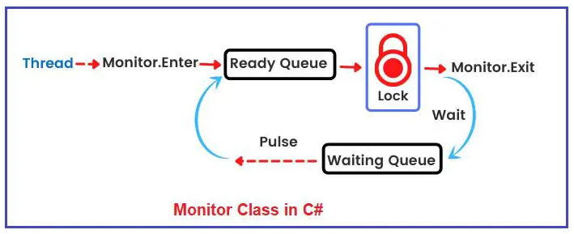
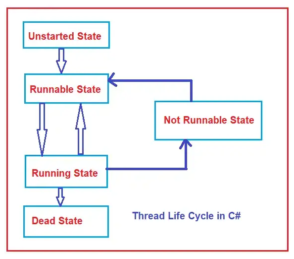

##### 进程

> 一个正在执行的程序就是一个进程


##### 线程

> 单位时间内 操作系统分配的cpu资源


##### 多线程

###### 好处

提高计算机cpu资源的利用率

提升并发处理的能力


###### 坏处

需要多学一点知识 代码较为复杂

除了基本的逻辑之外，还需要保证程序运行中数据的一致性  或者有时还有顺序要求

比如 `线程A`在读取`资源1` `线程B`在修改`资源1`


**怎么解决？**

1. Lock

    ```c#
    lock(obj){
    	// statement 1
    	// statement 2
    }
    ```

    原理:  使用Monitor

    ```c#
    bool lockWasToken = false;
    var temp = new Object();
    try{
    	Monitor.Enter(temp, ref lockWasToken);
        if(lockWasToken){
            // dosomething
        }
    }
    finally{
    	if(lockWasToken)
    		Monitor.Exit(temp);
    }
    ```

    Monitor的原理？

    

    [该图出自于](https://dotnettutorials.net/lesson/multithreading-using-monitor/)

    直白点就是利用队列 竞争同一个资源的线程任务排队一个一个的处理

    **多个线程轮询打印数字**

    ```c#
    internal class PrintNumber
        {
            private static readonly object _obj = new Object();
            const int numberLimit = 20;
            public static void Run()
            {
                Thread evenThread = new Thread(PrintEvenNumber);
                Thread oddThread = new Thread(PrintOddNumber);
    
                evenThread.Start();
                oddThread.Start();
            }
    
            private static void PrintEvenNumber()
            {
                try
                {
                    Monitor.Enter(_obj);	// 进入ready队列 等待获取锁
                    for (int i = 0; i <= numberLimit; i += 2)
                    {
                        Console.Write($"{i}  "); // 执行
                        
                        Monitor.Pulse(_obj);  // 当前线程执行完毕 发送信号到ready队列中 通知下一个线程任务
    
                        if (i <= numberLimit) // 如果这个线程后续还有任务
                        {
                            Monitor.Wait(_obj);	// 进入等待队列
                        }
                    }
                }
                finally
                {
                    Monitor.Exit(_obj);
                }
                
            }
    
            private static void PrintOddNumber()
            {
                try
                {
                    Monitor.Enter(_obj);
                    for (int i = 1; i < numberLimit; i += 2)
                    {
                        Console.Write($"{i}  ");
    
                        Monitor.Pulse(_obj);
    
                        if (i < numberLimit)
                        {
                            Monitor.Wait(_obj);
                        }
                    }
                }
                finally
                {
                    Monitor.Exit(_obj);
                }
            }
        }
    ```

    


2. Mutex

    Lock有一个问题  只能用于当前进程中的线程  无法用于外部线程

    比如  同一个窗体应用  我打开多次 但是我希望只能有一个生效 此时就需要用到Mutex了

    ```c#
    using System;
    using System.Threading;
    
    namespace MutexDemo
    {
        class Program
        {
            static void Main(string[] args)
            {
                using(Mutex mutex = new Mutex(false, "MutexDemo"))
                {
                    //Checking if Other External Thread is Running
                    if(!mutex.WaitOne(5000, false))
                    {
                        Console.WriteLine("An Instance of the Application is Already Running");
                        Console.ReadKey();
                        return;
                    }
                    Console.WriteLine("Application Is Running.......");
                    Console.ReadKey(); // 这是控制台读取输入流  如果没输入就会卡在这 模拟程序正在运行中
                }
            }
        }
    }
    ```

    编译上述控制台程序为exe  连续打开多个查看运行效果

    

3. Semaphore

    这个玩意儿 你可以理解为Mutex的升级版

    Mutex无法控制锁的数量

    比如我的某一个资源能够满足3个线程同时使用  超过三个时就会触发等待

    ```c#
    public class Test
    {
        public static Semaphore semaphore = null;
        public static void Main()
        {
            try
            {
               semaphore = Semaphore.OpenExisting("test");	// 初次执行 没有初始化锁 会触发异常
            }
            catch (Exception)
            {
                semaphore = new Semaphore(3, 3, "test"); 	// 初始化锁 设置资源并发数量为3
            }
            Console.WriteLine("External Thread Trying to Acquiring");
            semaphore.WaitOne();	// 若资源不满足时 会触发等待
            //This section can be access by maximum two external threads: Start
            Console.WriteLine("External Thread Acquired");
            Console.ReadKey();
            //This section can be access by maximum two external threads: End
            semaphore.Release();
        }
    }
    ```


##### 线程池

上面描述完线程中的一些用法以及场景，现在来看看还有没有啥问题.

首先需要透过问题看本质，先来看看线程的生命周期


**[该图出自于](https://dotnettutorials.net/lesson/multithreading-using-monitor/)**

这里面有个很浪费资源的事

**线程执行完被GC回收了**

假如我的场景中涉及到5个线程并发跑20次  也就是一共100次的任务

那么按照上述这种情况会创建100次线程并销毁 这是需要耗费额外的时间的

因为这个只涉及到5个线程并发的情况  那么其实只需要5个线程就好了，再多一个也没啥用 第6个依旧会在Ready队列中等待而已

那干嘛不让这5个 执行完毕之后不被销毁 继续去执行剩余的任务就好了

这就是线程池的作用

直白点说 线程池就是一个线程的集合，集合中的线程可以复用


#### AutoResetEvent、ManualResetEvent

这两个使用的是Singaling Methodology来实现多线程同步的

基本用法:

```c#
AutoResetEvent autoResetEvent = new AutoResetEvent(false);
autoResetEvent.set(); // 发送信号
autoResetEvent.waitOne(); // 等待信号
```


```c#
using System;
using System.Threading;
namespace SemaphoreDemo
{
    class Program
    {
        static AutoResetEvent autoResetEvent = new AutoResetEvent(false);
        
        static void Main(string[] args)
        {
            Thread newThread = new Thread(SomeMethod)
            {
                Name = "NewThread"
            };
            newThread.Start();	// 1.线程启动 执行SomeMethod
            Console.ReadLine();	// 4. 这个步骤与步骤2同时进行的 等待读取控制台输入  也就是模拟耗时任务
            autoResetEvent.Set();	// 5. 发送信号
        }
        static void SomeMethod()
        {
            Console.WriteLine("Starting........"); // 2. 控制台输出
            autoResetEvent.WaitOne(); // 3. 执行到这里会暂时挂起  等待信号 收到信号之后才会继续进行后续步骤
            Console.WriteLine("Finishing........"); // 6. 等第5步发出信号后 才会进行第3步之后的动作
      		Console.ReadLine();
        }
    }
}
```

输出结果:

```
Starting........

Finishing........
```


ManualResetEvent的用法与AutoResetEvent的用法一致

只不过ManualResetEvent会同时发送信号给所有在等待的线程  AutoResetEvent只发送一个信号给第一个在等待的线程


#### 线程状态



**[该图出自于](https://dotnettutorials.net/lesson/multithreading-using-monitor/)**

###### Unstated State

Thread thread = new Thread(func)

创建线程 但是还没有启动

##### Runnable State

thread.Start()

启动了  但是此时并不是真正的再执行  此时需要等待线程调度器来执行(只不过这个时间一般很短很短)

##### Running State

真正开始执行了

###### Not Runnable State

以下几个场景都会进入到这个状态

1. thread.Wait()
2. thread.Sleep()
3. 线程中的任务包含输入/输出操作  比如读写文件、Console.ReadLine()...
4. 线程A中调用线程B的.Join()方法时  线程A会进入这个状态 等待线程B执行完毕之后才会继续  也就是重新进入Runnable State

##### Dead State