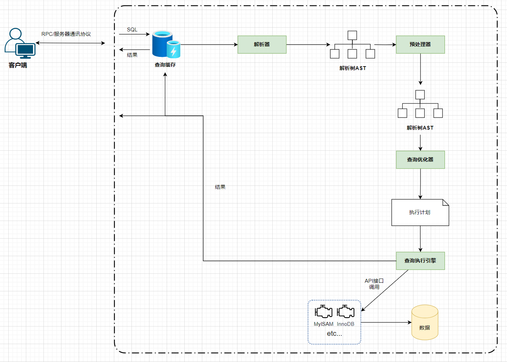
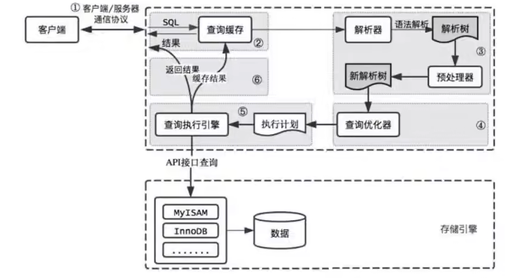
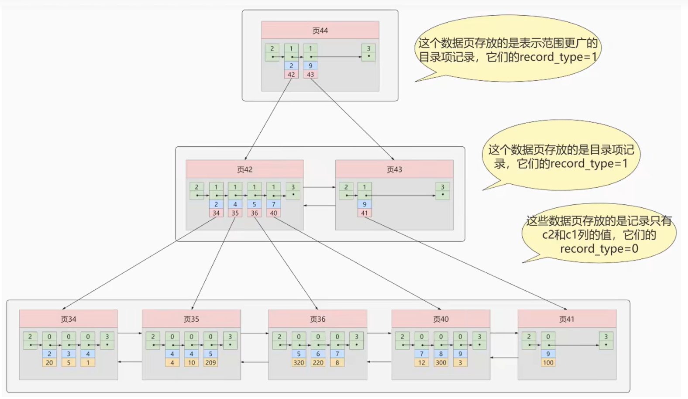

#### SQL执行流程

#### 索引

##### 什么是索引

索引是存储引擎中用于快速查找数据的一种数据结构 类似词典的目录

mysql中进行数据查找时，首先查看查询条件是否命中某条索引，符合则`通过索引查找`相关数据

不符合时则`全表扫描`相关数据 一条一条的扫描所有数据 这样很慢

##### 为什么索引查找会很快

索引很好的利用了折半查找的思想 在存储时根据`聚簇索引`**有序**的存储数据

`全表扫描`: $O(n)$

`索引查找`: $O(\log_2{n})$

##### 索引的优缺点

`优点`: 

	1. 提高数据的检索效率(减少磁盘IO)
	1. 加速表与表之间的连接(加快多表查询速度)
	1. 减少查询中分组和排序的时间(降低CPU消耗)
	1. 唯一索引(保证了数据的唯一性)

`缺点`:

1. 创建索引和维护索引也有时间开销
2. 索引有额外的存储空间消耗
3. 降低`增、删、改`操作的速度(操作数据后也要动态维护索引)

> 频繁的`增、删、改`操作 很有可能导致维护索引的时间剧增
>
> 此时更好的操作是 删除索引 等待批量操作完成后重新创建该索引

##### 索引的实现原理

核心就是折半查找思想

1. 二叉搜索树(Binary Search Tree)

   左子树 《 根节点  《 右子树

   `缺点`: 左右子树可能严重失衡,退化成单链表$O(n)$

2. 平衡二叉树

   左子树 《 根节点  《 右子树

   左子树 右子树之间的高度差不大于1  $|h(left) - h(right)| <=1 $

   `缺点`: 增、删、改后可能导致 左右子树失衡 此时需要旋转调整 很耗时

3. 红黑树

   左子树 《 根节点  《 右子树
   
   暂时先不研究...
   
   `缺点`: 层数太高 一个节点内能够存储的信息太少 磁盘IO依旧降不下来

4. 平衡树(Balance Tree、B树) 

   下方链接自行参考...

   `缺点`: 由于非叶子节点也要存储数据 导致相同阶数、层数的树中能存的数据更少 在排序、范围查找、去重等效果也不太好

5. 平衡树改良版(Balance Plus Tree、B+树)

   所有数据存于叶子节点 非叶子节点作为`目录` 一级目录、二级目录...

   一般不超过

> Mysql InnoDB引擎中页的默认大小为`16`K  Linux操作系统的页默认大小为`4`K
>
> B+树层高一般不会超过4层

**计算一个三层高的B+树能存多少条记录**

假设：一条记录占用`1KB` 一个目录项占用`16B` *忽略相同层的链表指针*

三层高  那么前两层为目录页

目录页中目录项个数为: 16KB / 16B = 1024个

数据页中数据项个数为: 16KB / 1KB = 16个

数据页上一层目录页个数: 1024(页) * 1024(目录项) = 1,048,576

所以 数据页的个数 = 1,048,576

数据个数 = 1,048,576(数据页) * 16(数据项) = 16,777,216个

**二级索引**

[MySQL索引-B+树（看完你就明白了） - 苍青浪 - 博客园 (cnblogs.com)](https://www.cnblogs.com/cangqinglang/p/15042752.html)

##### 索引的分类

1. 聚簇索引
2. 二级索引
3. 联合索引

