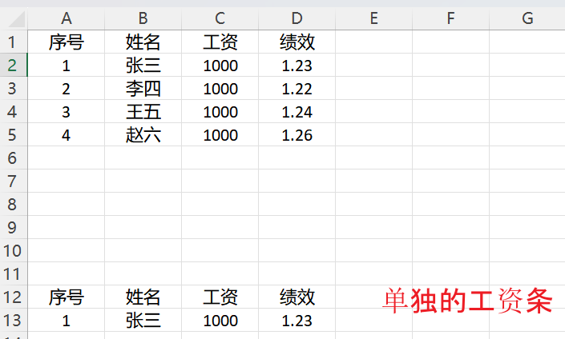
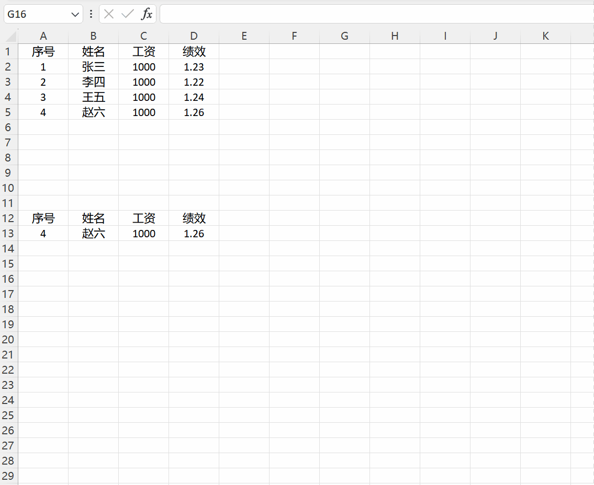

##### 需求

> 有一张表格中包含多个人员的工资条   想要单独展示每一个人的工资



##### 解决思路

使用vlookup `A13`中输入序号1(对应上述表格中你需要的那一条数据)

```c
# B13单元格输入如下公式
=VLOOKUP($A13,$A$1:$D$5,COLUMN(),0)
```

vlookup(找寻的值, 在哪个区域中找, 返回匹配值所在的列, 精确匹配)

C13、D13 选中B13向右拖动就好

此时切换A13单元格中的值  B13、C13、D13也会发生相应的更改

##### 优化

将A13建立为下拉列表(数据为上述表格中的序号数据) 这样就只需要点点点了:smile:


