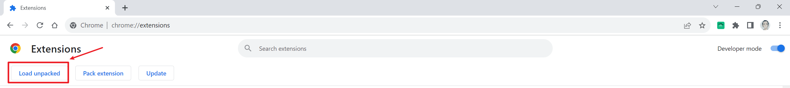

##### 起因

某天，表姐问我是否有自动刷课的工具，她还有好多课需要刷...

但是又很不凑巧，她所使用的网站平台比较特殊，没有现成的插件:cry:

所以我想着 制作一个基于Google浏览器的插件

让课程播放完成后自动播放下一个:smiley:


#### 流程

1. 制作js脚本
2. 放置在Google浏览器插件中
3. 刷新网页 就能够自动运行脚本啦


##### 1. 制作JS脚本

###### 项目结构:

```c
autoPlay					 
--js						 
----autoPlay.js					# js脚本
--manifest.json					# 配置项 配置脚本在Google浏览器插件中的信息，以及如何运行脚本
```


接下来就是写脚本了

自动播放流程如下:

1. 检索网页中需要播放的课程列表

2. 获取第一个待播放的视频的总时长、已经播放的时常

3. 播放第一个视频

4. 设置定时器 等第一个视频播放完成后 播放下一个视频

    ```javascript
    setTimeout(()=>{
        播放下一个视频
    }, 第一个视频总时长-已经播放的时常 )
    ```

5. 但是这种只能连续播放两个 想要一直下去 直接搞一个递归

完整代码如下:

```javascript
// autoPlay.js
function auto(){
  var tableArr = document.querySelectorAll('#right .dataTable')
  if(!tableArr || tableArr.length != 2)
    return;
  const trArr = tableArr[1].getElementsByTagName("tr")  // 获取待播放的视频列表
  autoPlay([...trArr])
}

function autoPlay(trArr){
  const progress = trArr[1].querySelector(".jindu")
  const pArr = progress.title.split('/')
  const curProgress = parseInt(pArr[0]) // 获取已经播放的时常
  const allProgress = parseInt(pArr[1]) // 获取总时长
  if(curProgress < allProgress){
    trArr[1].querySelector('a').click() // 点击播放
  }

  // 等待一段时间后 执行下一个视频的播放
  const delay = (allProgress - curProgress) * 60 * 1000 + 10000;
  if(trArr.length == 1) // 当前就是最后一个视频了就没有后续的步骤了
    return;
  trArr.splice(0, 1)  // 移除第一个视频
  setTimeout(()=>{
    autoPlay(trArr)   // 递归调用
  },delay)
}

// 处理播放视频页面需要手动点击继续播放/开始播放
function playVideo(){
  const ifm = document.querySelector('#course_frame')
  const doc = ifm.contentWindow.document;
  const mask = doc.querySelector(".continue")
  if(!mask)
    return;
  setTimeout(() => {
    mask.lastElementChild.click()
  }, 2000);
}

// 由于播放视频的窗口中涉及到iframe 并且牵扯到跨域 这里直接使用iframe的地址打开
function openNewPage(){
  const ifm = document.querySelector('c>iframe')
  if(!ifm)
    return;
  window.location = ifm.src
}

window.addEventListener('load',()=>{
  auto()
  openNewPage()
  playVideo()
})
```


```json
// manifest.json
{
  "manifest_version": 2,	// google插件版本 不同的版本号配置有些出入
  "name": "奥特曼",	// 在插件中显示的名称
  "version": "1.0.0",	// 插件版本
  "description": "主打一个懒", // 插件的描述
  "content_scripts": [
    {
      "matches": ["https://www.abcde.cn/*", "https://cdn.abcde.cn/*"],	// 匹配这些网站时才会生效
      "js": ["js/autoPlay.js"],	// 生效时要运行的脚本
      "run_at": "document_idle"
    }
  ],
  "content_security_policy": "script-src 'self' *"	// 解决跨域冲突
}
```


然后在google插件中 点击`加载已解压的文件`




然后你就可以在你的扩展中看到刚刚写的插件  记得启用:star:


