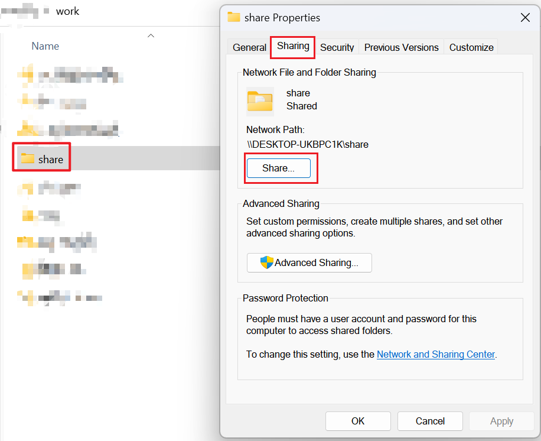
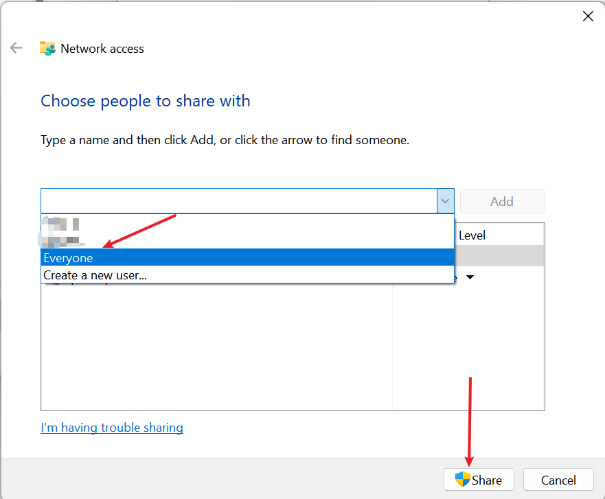
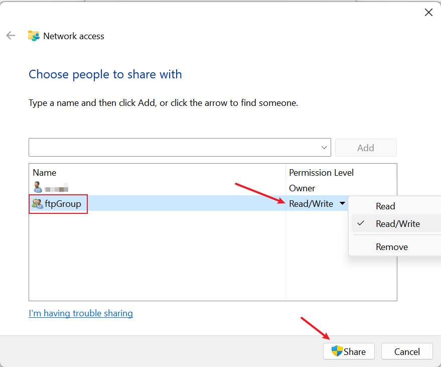

##### 需求背景

一个小组内经常需要编辑一些文件、然后再分享到微信群里...

这就会导致 即时是同一个文件也会存在多份不同的版本 长此以往 `占空间` `太多文件很杂乱`

所以一个文件夹共享就蛮有用的

##### 实现要求

1. 一台电脑
2. 一个局域网(暂时不考虑公网访问... 下班时间应该有自己的生活、休养生息:laughing:)

##### 实现原理

###### 基础实现

在电脑中选择一个文件夹  右键--》属性--》共享--》共享

选择要分享给什么用户 Everyone就是任何人  然后设置读取权限 再点击共享

此时跟你同一个局域网下面的小伙伴就能够在资源管理器中输入你的ip地址 访问这个文件夹下面的东西啦

###### 权限控制

上述的基础实现有个很严重的问题  只要别人知道我的ip 他就能通过局域网访问到我这里面的内容了 很危险:disappointed_relieved:

解决思路如下:

1. 新建一个本地用户(非必须 但是推荐)

    [win10家庭版新建用户](https://zhuanlan.zhihu.com/p/267705488)   其他版本自行百度一下:kissing_heart:

2. 将待分享的文件夹(如上述的`share`) 取消之前的共享给Everyone  而是共享给你新建的这个用户

此时当其他人想要访问这个共享文件夹时就需要有新建的这个用户的身份才行(也就是需要登录认证)

上图中 只要是ftpGroup这个用户组的用户 那么就对这个文件夹有读写权限

所以只有其他用户知道我ftpGroup中的某个用户的信息(账号、密码)  才能够访问到这个文件夹

此时大功告成...

> 如果想要给不同的人不同的权限  那么你就需要再创建新的用户  在共享时为不同用户设置不同权限

###### 待优化

还有个问题... 我想限制我这个文件夹的容量限制(万一向我这个共享文件夹中传入特别多文件  导致我磁盘爆满可不太好)

这个问题暂时没解决...  貌似需要用到三方工具 对磁盘做映射

emm 暂时够用 先不管:dog2: