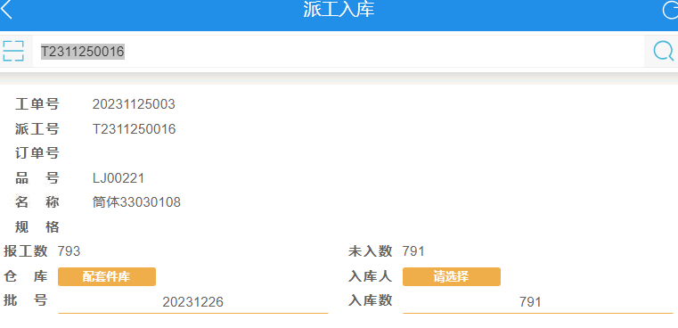

采购模块： 采购订单–》采购收料-》收料检验 bug修改

- [x] 采购收料 主页面 选择供应商时，只显示有收料单的供应商   原有的是全部显示

- [x] 采购收料 主页面 新增显示供应商

- [x] 采购收料 未收料数bug处理  原有的收料后 未收料数没有发生任何变化

- [ ] 采购收料 详情保存页  保存时收料记录同时存到MES的checklist1中去  UserFld005 供应商

- [ ] 收料检验 检验后  收料数据中 DCSHDB.HDB020(已收料量) 中的数据流转到DCSHDB.HDB018(已交量)

    已收料量和已交量的区别:

    猜测一下  采购了一批东西    收料以后–》HDB020    等检验后 HDB020-》HDB018 


```
delete t1 from SGMRBB t1
right join SGMRBA t2 on t1.RBB002 = t2.RBA002
where RBA005 = '402' and RBA009 ='自动扣料'
```


### CheckList1


##### 目前的情况：

报工：795        良品:793    不良：2

###### 但是：

派工入库界面： 报工数 793	未入库数 791

**希望调整为**：     报工数795	未入库数793      (不良的2个已经入库了)


之前派工入库界面：

报工数的数据  来自最后一道工序的良品数：  也就是793

未入库数：最后一道工序的良品数- 入库数      793-2 = 791


那么我改为如下:

报工数的数据  来自最后一道工序的良品数+不良数  793+2 = 795

未入库数：最后一道工序的良品数+不良数 - 入库数   793+2-2 = 793


| 工序  | 派工数 | 良品 | 不良 |
| ----- | ------ | ---- | ---- |
| 工序1 | 795    | 795  | 0    |
| 工序2 | 795    | 795  | 0    |
| 工序3 | 795    | 793  | 2    |

最开始 派工入库



这里的计算逻辑：

报工数= 最后一道工序的良品 = 793

未入库数= 最后一道工序的良品数 - 入库数 = 793 - 2


### 易达

#### 正式

MES：8000

PDA：4000

#### 测试

MES：8006

PDA：4006
