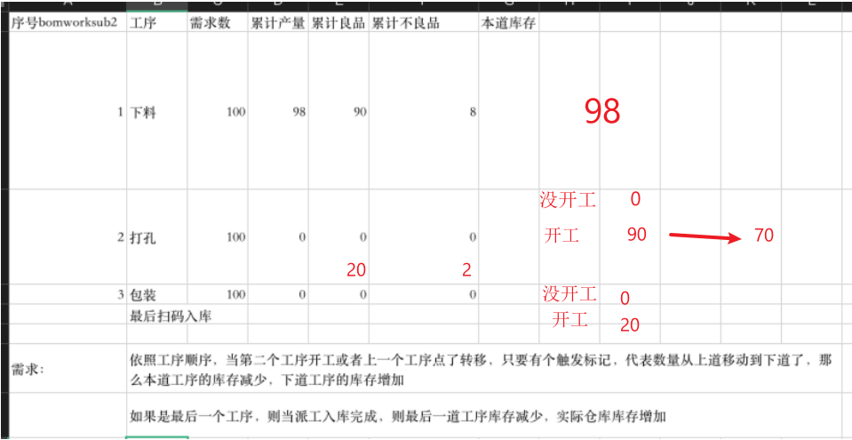

# 任务

帮我吧：`305594213` 密码：`admin@123`

**实现库存报表**

- [ ] 一个按钮 显示当前工序是否开工

    `BOMWORKSUB2`.`UserFld10` 为1时表示开工

    `BOMWORKSUB2`.`UserFld11` 存储当前工序能够使用的剩余库存

    `BOMWORKSUB2`.`UserFld12` 默认现场仓 可选择其他仓库

- [ ] 当前工序开工会带入上一道工序的良品数量  (`此道工序最多能完工的数量` = `上一道工序的良品数量`)

    如果是第一道工序   `最多能完工的数量`= `派工数量`

- [ ] 保存时 如果是最后一道工序

| **工序** | **需求数** | **累计产量** | **累计良品** | **累计不良品** | 库存地点 |
| -------- | ---------- | ------------ | ------------ | -------------- | -------- |
| 下料     | 100        | 98           | 90           | 8              | 0        |
| 打孔     | 100        | 0            | 20           | 2              | 1/2 = 0  |
| 包装     | 100        | 0            | 10           | 0              | 0        |

用户场景： 可能某道工序做完后 并不会立马开始下一道工序  可能会将这道工序的产物移动到楼上去，楼上存在多个存放货物地点   所以需要记录当前工序的产物到底存放在哪一个地点(库位)

# 场景一:

| **工序** | **是否开工** | **需求数** | **完工数** | **累计良品** | **累计不良品** | **库存地点** |
| -------- | ------------ | ---------- | ---------- | ------------ | -------------- | ------------ |
| 下料     | ✅            | 100        | 0          | 0            | 0              | 0            |
| 打孔     |              | 100        | 0          | 0            | 0              | 1/2=0        |
| 包装     |              | 100        | 0          | 0            | 0              | 0            |

最开始时：默认开工第一道工序

第二道无法开启,因为第一道还没有可用库存

# 场景二：

| **工序** | **是否开工** | **需求数** | **完工数** | **累计良品** | **累计不良品** | **可用库存** |
| -------- | ------------ | ---------- | ---------- | ------------ | -------------- | ------------ |
| 下料     | ✅            | 100        | 9          | 8            | 1              | 8            |
| 打孔     |              | 100        | 0          | 0            | 0              |              |
| 包装     |              | 100        | 0          | 0            | 0              |              |

此时第二道工序可以开启了 因为现在有可用库存了

# 

# 场景三：

| **工序** | **是否开工** | **需求数** | **完工数** | **累计良品** | **累计不良品** | **可用库存** |
| -------- | ------------ | ---------- | ---------- | ------------ | -------------- | ------------ |
| 下料     | ✅            | 100        | 9          | 8            | 1              | 0            |
| 打孔     | ✅            | 100        | 0          | 8            | 0              |              |
| 包装     |              | 100        | 0          | 0            | 0              |              |

点击第二道的开工 会把上一道的可用库存流转到当前工序的可用库存

# 场景四：

| **工序** | **是否开工** | **需求数** | **完工数** | **累计良品**   | **累计不良品** | **可用库存** |
| -------- | ------------ | ---------- | ---------- | -------------- | -------------- | ------------ |
| 下料     | ✅            | 100        | 9          | 8              | 1              | 0            |
| 打孔     | ✅            | 100        | 0          | 0+2(上限为8个) | 0              | 8            |
| 包装     |              | 100        | 0          | 0              | 0              |              |

保存后：

这里的可用库存怎么变化

| **工序** | **是否开工** | **需求数** | **完工数** | **累计良品** | **累计不良品** | **可用库存** |
| -------- | ------------ | ---------- | ---------- | ------------ | -------------- | ------------ |
| 下料     | ✅            | 100        | 9          | 8            | 1              | 0            |
| 打孔     | ✅            | 100        | 2          | 2            | 0              | **8**        |
| 包装     |              | 100        | 0          | 0            | 0              |              |

# 场景五：

| **工序** | **是否开工** | **需求数** | **完工数** | **累计良品** | **累计不良品** | **可用库存** |
| -------- | ------------ | ---------- | ---------- | ------------ | -------------- | ------------ |
| 下料     | ✅            | 100        | 9          | 8+2          | 1              | 0            |
| 打孔     | ✅            | 100        | 2          | 2            | 0              | 8            |
| 包装     |              | 100        | 0          | 0            | 0              |              |

当这里保存后 效果如下：

| **工序** | **是否开工** | **需求数** | **完工数** | **累计良品** | **累计不良品** | **可用库存** |
| -------- | ------------ | ---------- | ---------- | ------------ | -------------- | ------------ |
| 下料     | ✅            | 100        | 11         | 10           | 1              | 0            |
| 打孔     | ✅            | 100        | 2          | 2            | 0              | 10           |
| 包装     |              | 100        | 0          | 0            | 0              |              |

# 场景六：

| **工序** | **是否开工** | **需求数** | **完工数** | **累计良品** | **累计不良品** | **可用库存** |
| -------- | ------------ | ---------- | ---------- | ------------ | -------------- | ------------ |
| 下料     | ✅            | 100        | 11         | 10+4         | 1              | 0            |
| 打孔     | ✅            | 100        | 2          | 2+1          | 0              | 10           |
| 包装     |              | 100        | 0          | 0            | 0              |              |

保存后： 打孔的可用库存数怎么变

| **工序** | **是否开工** | **需求数** | **完工数** | **累计良品** | **累计不良品** | **可用库存** |
| -------- | ------------ | ---------- | ---------- | ------------ | -------------- | ------------ |
| 下料     | ✅            | 100        | 15         | 14           | 1              | 0            |
| 打孔     | ✅            | 100        | 3          | 3            | 0              | **14**       |
| 包装     |              | 100        | 0          | 0            | 0              |              |

# 场景七：

| **工序** | **是否开工** | **需求数** | **完工数** | **累计良品** | **累计不良品** | **可用库存** |
| -------- | ------------ | ---------- | ---------- | ------------ | -------------- | ------------ |
| 下料     | ✅            | 100        | 15         | 14           | 1              | 0            |
| 打孔     | ✅            | 100        | 3          | 3            | 0              | 14           |
| 包装     |              | 100        | 0          | 0            | 0              |              |

开启第三道工序：

| **工序** | **是否开工** | **需求数** | **完工数** | **累计良品** | **累计不良品** | **可用库存** |
| -------- | ------------ | ---------- | ---------- | ------------ | -------------- | ------------ |
| 下料     | ✅            | 100        | 15         | 14           | 1              | 0            |
| 打孔     | ✅            | 100        | 3          | 3            | 0              | 11           |
| 包装     | ✅            | 100        | 0          | 0            | 0              | 3            |

# 场景八：

| **工序** | **是否开工** | **需求数** | **完工数** | **累计良品** | **累计不良品** | **可用库存** |
| -------- | ------------ | ---------- | ---------- | ------------ | -------------- | ------------ |
| 下料     | ✅            | 100        | 15         | 14           | 1              | 0            |
| 打孔     | ✅            | 100        | 3          | 3            | 0              | 11           |
| 包装     | ✅            | 100        | 0          | 0+2          | 0              | 3            |

保存后：

| **工序** | **是否开工** | **需求数** | **完工数** | **累计良品** | **累计不良品** | **可用库存** |
| -------- | ------------ | ---------- | ---------- | ------------ | -------------- | ------------ |
| 下料     | ✅            | 100        | 15         | 14           | 1              | 0            |
| 打孔     | ✅            | 100        | 3          | 3            | 0              | 11           |
| 包装     | ✅            | 100        | 2          | 2            | 0              | **3**        |

# 场景九

| **工序** | **是否开工** | **需求数** | **完工数** | **累计良品** | **累计不良品** | **可用库存** |
| -------- | ------------ | ---------- | ---------- | ------------ | -------------- | ------------ |
| 下料     | ✅            | 100        | 15         | 14           | 1              | 0            |
| 打孔     | ✅            | 100        | 3          | 3+2          | 0              | 11           |
| 包装     | ✅            | 100        | 2          | 2            | 0              | **3**        |

保存后：

| **工序** | **是否开工** | **需求数** | **完工数** | **累计良品** | **累计不良品** | **可用库存** |
| -------- | ------------ | ---------- | ---------- | ------------ | -------------- | ------------ |
| 下料     | ✅            | 100        | 15         | 14           | 1              | 0            |
| 打孔     | ✅            | 100        | 5          | 5            | 0              | 9            |
| 包装     | ✅            | 100        | 2          | 2            | 0              | **5**        |

**生产入库：**

当前派工单最后一道工序的可用库存数 - 入库数量

报工单删除后 派工单工序可用库存会有相应的更改

| **工序** | **是否开工** | **需求数** | **完工数** | **累计良品** | **累计不良品** | **可用库存** |
| -------- | ------------ | ---------- | ---------- | ------------ | -------------- | ------------ |
| 下料     | ✅            | 100        | 15         | 14           | 1              | 0            |
| 打孔     | ✅            | 100        | 3          | 3            | 0              | 11           |
| 包装     | ✅            | 100        | 2          | 2            | 0              | **3**        |

#### 库存计算：

若当前工序已经开工：

​	last = 上一道工序

​	current = 当前工序

​	current.可用库存 = last.良品数 - current.完工数

​	如果是第一道：

​		current.可用库存 = current.良品数

若下一道工序未开工：

​	current = 当前工序

​	next = 下一道工序

​	current.可用库存  = current.良品数

- [x] 

查询每个工序的库存是多少？

> 每道工序的库存可能会存留

按照最小流转单位处理  要么全部流转过去

每道工序一次性报完  上一次报完下一道才能继续报

派工单单号 工序代码 

# 更改点

###### 工单报工：

- [x] 每道工序新增是否开工控制    用于控制工序库存    数据表: `BOMWORKSUB2`.`UserFld10`
- [x] 每道工序移除`工废`   、`料废`改为不良
- [x] 每道工序显示良品数、不良品数
- [x] 隐式存储每道工序的可用库存数 数据表:`BOMWORKSUB2`.`UserFld11`   `BOMWORKSUB2`.`UserFld12`

###### 报工修改:

- [x] 新增报工修改功能 修改派工单工序报工数量  更新数据并记录原始数据 数据表: `BOMWORKSUB2`.`UserFld09`

- [ ] 已完工的工序 修改为尚未完工的数据时  要不要影响后续工序

    比如 工序1 完成100  工序2完成90个

    工序1 改成80个  工序2此时怎么算？

    1. 工序2重置  因为按照报工的逻辑   工序1没有做完  工序2是无法开工的
    2. 工序2扣除良品10个  工序2变为80个

    这里比较麻烦  还要考虑到可用库存的更新 比如上一道可用库存本来是0  更新后会涉及到流转到下一道

​	目前程序的做法： 只考虑不良产生时的不可用库存数  
