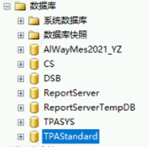

#### 用户信息

```sql
select DBA001 CODE, DBA002 CNAME, DBD003 PASS from TPADBD A,TPADBA B where B.DBA001=A.DBD001 AND DBD001 = 'DS' 
```

> 拿这个PASS里面的结果去这里里面解密

[MD5免费在线解密破解_MD5在线加密-SOMD5](https://www.somd5.com/)


```
using System;
using System.Data;
using System.Data.SqlClient;
using System.Reflection;

public class Program
{
    // 定义一个泛型方法，接受一个 DataReader 参数和一个泛型类型参数 T ，返回一个 T 类型的对象
    public static T ConvertDataReaderToGeneric<T>(IDataReader reader) where T : new()
    {
        // 创建一个泛型对象实例
        T t = new T();
        // 获取泛型对象的类型
        Type type = typeof(T);
        // 获取泛型对象的公共属性
        PropertyInfo[] properties = type.GetProperties();
        // 遍历泛型对象的每一个属性
        foreach (PropertyInfo property in properties)
        {
            // 获取属性名
            string name = property.Name;
            // 判断 DataReader 中是否存在该列
            if (reader[name] != null && reader[name] != DBNull.Value)
            {
                // 给泛型对象的属性赋值
                property.SetValue(t, reader[name], null);
            }
        }
        // 返回泛型对象
        return t;
    }

    // 定义一个测试方法，使用 ADO.NET 方式读取一行数据，并以反射的方式转为泛型对象
    public static void Test()
    {
        // 定义一个连接字符串
        string connectionString = "Data Source=(local);Initial Catalog=Northwind;Integrated Security=SSPI";
        // 定义一个查询语句
        string queryString = "SELECT * FROM Customers WHERE CustomerID = 'ALFKI'";
        // 创建一个连接对象
        using (SqlConnection connection = new SqlConnection(connectionString))
        {
            // 创建一个命令对象
            SqlCommand command = new SqlCommand(queryString, connection);
            // 打开连接
            connection.Open();
            // 执行命令，返回一个 DataReader 对象
            SqlDataReader reader = command.ExecuteReader();
            // 读取第一行数据
            if (reader.Read())
            {
                // 调用泛型方法，将 DataReader 转为泛型对象
                Customer customer = ConvertDataReaderToGeneric<Customer>(reader);
                // 输出泛型对象的属性
                Console.WriteLine("CustomerID: {0}", customer.CustomerID);
                Console.WriteLine("CompanyName: {0}", customer.CompanyName);
                Console.WriteLine("ContactName: {0}", customer.ContactName);
                Console.WriteLine("ContactTitle: {0}", customer.ContactTitle);
                Console.WriteLine("Address: {0}", customer.Address);
                Console.WriteLine("City: {0}", customer.City);
                Console.WriteLine("Region: {0}", customer.Region);
                Console.WriteLine("PostalCode:
```

