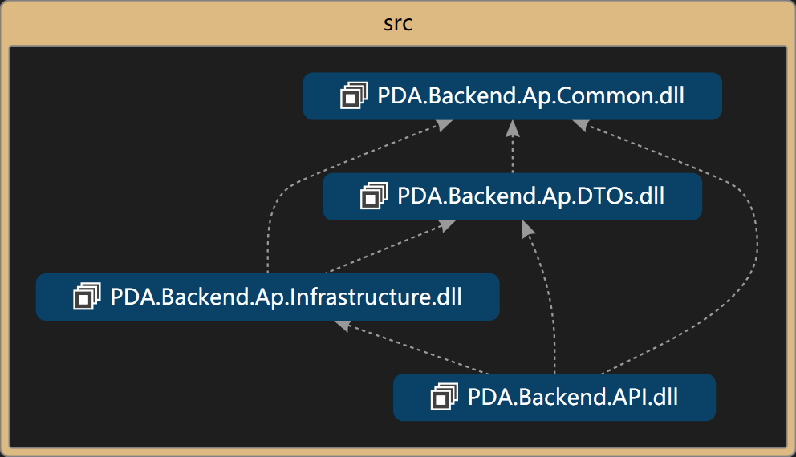
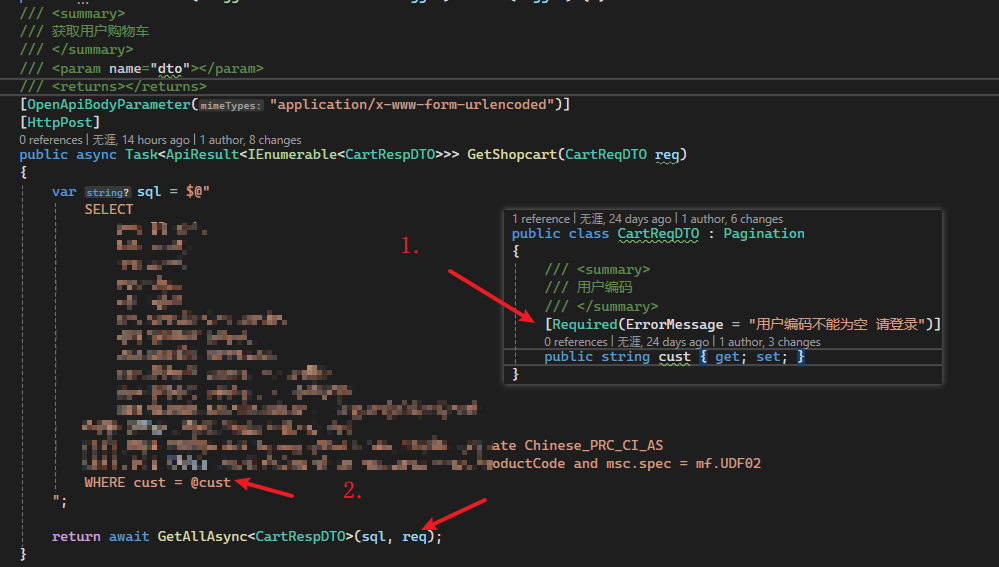
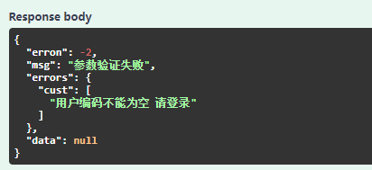
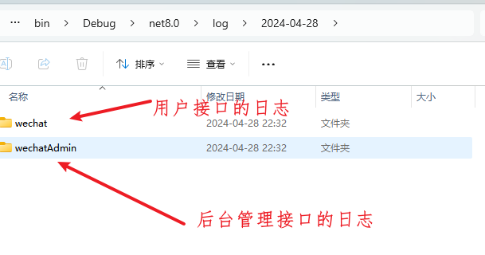

## 技术栈

框架: `.NET 8 WebAPI`

接口文档: `NSwag`

日志:`Serialog`

模型验证:`System.ComponentModel.DataAnnotations`

SqlHelper:`Dapper`


## 项目结构说明

```c#
--src
--PDA.Backend.Ap.Common	// 通用
--PDA.Backend.Ap.DTOs	// DTOs 接口实体
--PDA.Backend.Ap.Infrastructure // 基础设施
--PDA.Backend.API // 接口
```


#### 依赖组织图



## 特色

#### 业务与请求参数验证分离



在第一处: 在模型中已经维护好了相应字段的验证



在第二处: 利用Dapper的参数化方式 以相对简便的方式编写防止SQL注入的sql


#### 日志分类



可以将不同模块中的日志 分类处理

## 源码


```c#
public class Pagination{
    public int start {get;}
    public int end {get;}
}

public class ReqDTO: Pagination{
    ///
    /// this is name
    ///
    [Required]
    public string Name {get; set;}
    
    ///
    /// this is count
    ///
    public string Count {get; set;}
}
```

```c#
public class TestController: ControllerBase
{
    [OpenApiBodyParameter("application/x-www-form-urlencoded")]
	[HttpPost]
    public IActionResult GetList(ReqDTO req){
        
    }
}
```

The JSON file generated by default is as follows:

```json
"ReqDTO": {
        "allOf": [
          {
            "$ref": "#/components/schemas/Pagination"
          },
          {
            "type": "object",
            "additionalProperties": false,
            "required": [
              "Name"
            ],
            "properties": {
              "Name": {
                "type": "string",
                "description": "this is name",
                "minLength": 1
              },
              "Count": {
                "type": "integer",
                "description": "this is count",
                "nullable": true
              },
            }
          }
        ]
      },
```


`in the redoc UI`

```c#
// The order in which the fields are displaed in the redoc UI document
// default
Fields		Description
start		
end		
Name		this is name
Count		this is count
```


```c#
// I’d like to be able to control the order in which the fileds are displayed
// like this:
Fields		Description
start		
end		
Name		this is name
Count		this is count
```

**I want the fields of the objects referenced in allOf to be ranked after the fields of the inheritance class at the time of the final rendering**


如何自定义字段显示顺序
