# 派工单增强配置

## 1. 菜单配置

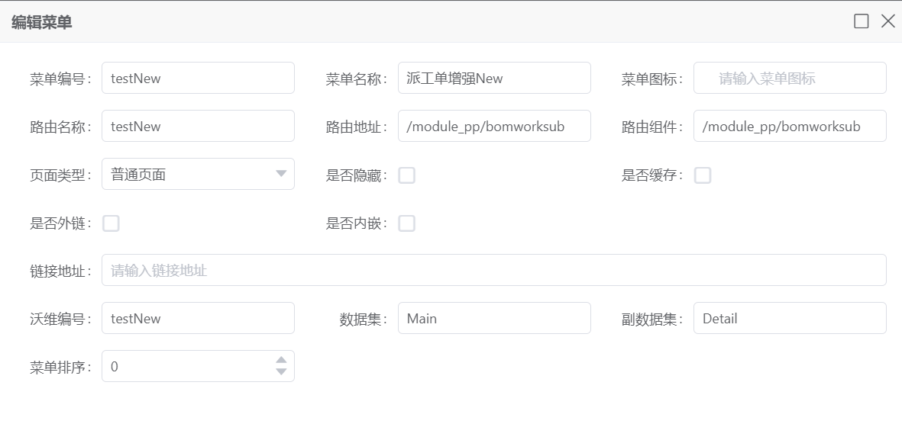

## 2. 功能配置

### 1. 主档

#### 1. 图


#### 2. sql

```sql
SELECT *,'' productName,0 taskNumberTotal, 0 taskedNumberTotal
FROM BOMWORKSUB1
```

#### 3. 字段配置

> 说明 配置下面的字段所需的弹窗配置 请移至文档底部

[YFWorkOrder](#1. YFWorkOrder)

##### 1. 图

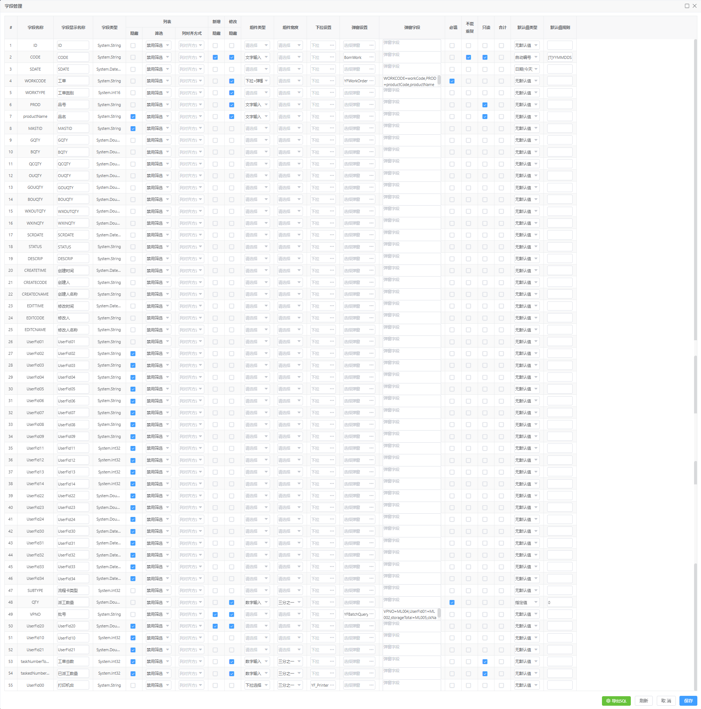

##### 2. 弹窗字段

1. WORKCODE

    ```sql
    WORKCODE=workCode,PROD=productCode,productName=productName,WORKTYPE=orderType,unit=unit,taskNumberTotal=taskNumberTotal,taskedNumberTotal=taskedNumberTotal
    ```

2. VPNO

    这个字段不用配置了  原本是需要的  后续逻辑变更 现在不用管了

### 2. 材料

#### 1. 图

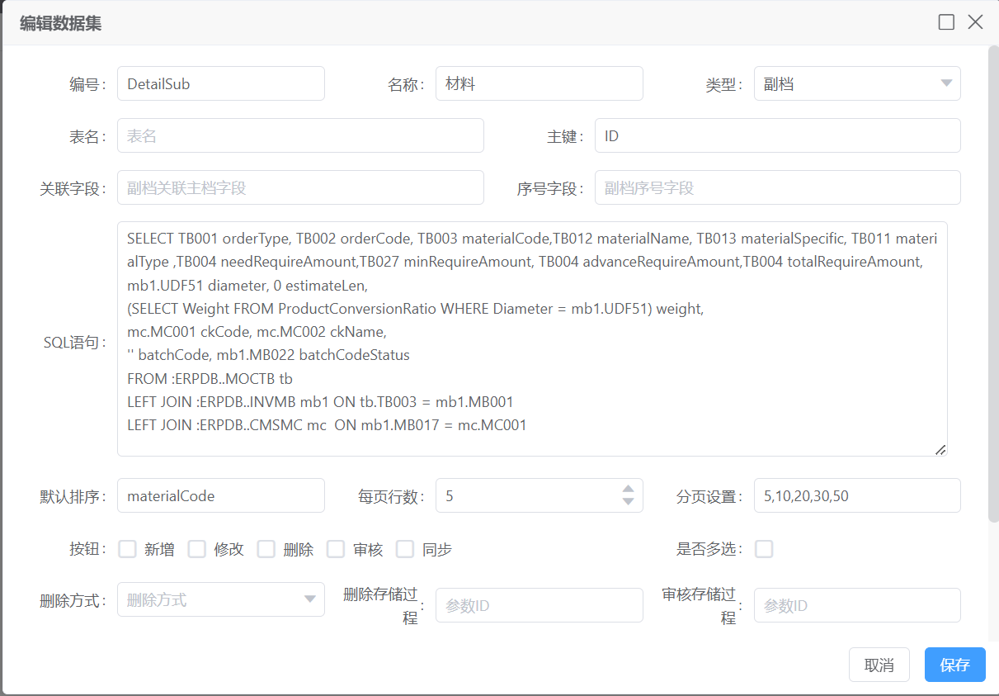

#### 2. sql

```sql
SELECT TB001 orderType, TB002 orderCode, TB003 materialCode,TB012 materialName, TB013 materialSpecific, TB011 materialType ,TB004 needRequireAmount,TB027 minRequireAmount, TB004 advanceRequireAmount,TB004 totalRequireAmount,
mb1.UDF51 diameter, 0 estimateLen,
(SELECT Weight FROM ProductConversionRatio WHERE Diameter = mb1.UDF51) weight,
mc.MC001 ckCode, mc.MC002 ckName,
'' batchCode, mb1.MB022 batchCodeStatus
FROM :ERPDB..MOCTB tb
LEFT JOIN :ERPDB..INVMB mb1 ON tb.TB003 = mb1.MB001
LEFT JOIN :ERPDB..CMSMC mc  ON mb1.MB017 = mc.MC001
```


#### 3. 字段配置

[YF_PP_ckQuery](#5. YF_PP_ckQuery)

[YFBatchQuery](#2. YFBatchQuery)

##### 1. 图

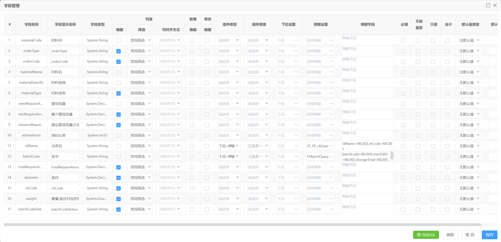

##### 2. 弹窗字段

1. ckName

    ```sql
    ckName=MC002,ckCode=MC001
    ```

2. batchCode

    ```sql
    batchCode=ML004,UserFld01=ML002,storageTotal=ML005,ckName=ckName
    ```

    

### 3. 工序

#### 1. 图

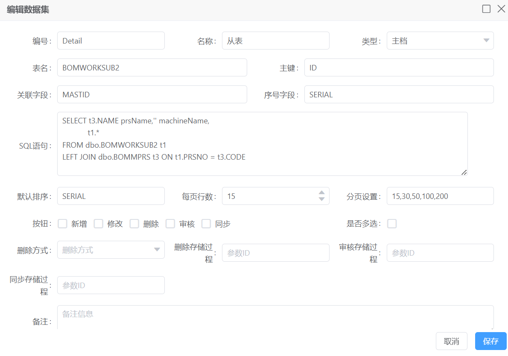

#### 2. sql

```sql
SELECT t3.NAME prsName,'' machineName,
            t1.*
FROM dbo.BOMWORKSUB2 t1
LEFT JOIN dbo.BOMMPRS t3 ON t1.PRSNO = t3.CODE
```


#### 3. 字段配置

[YFMakeLine](#4. YFMakeLine)

##### 1. 图

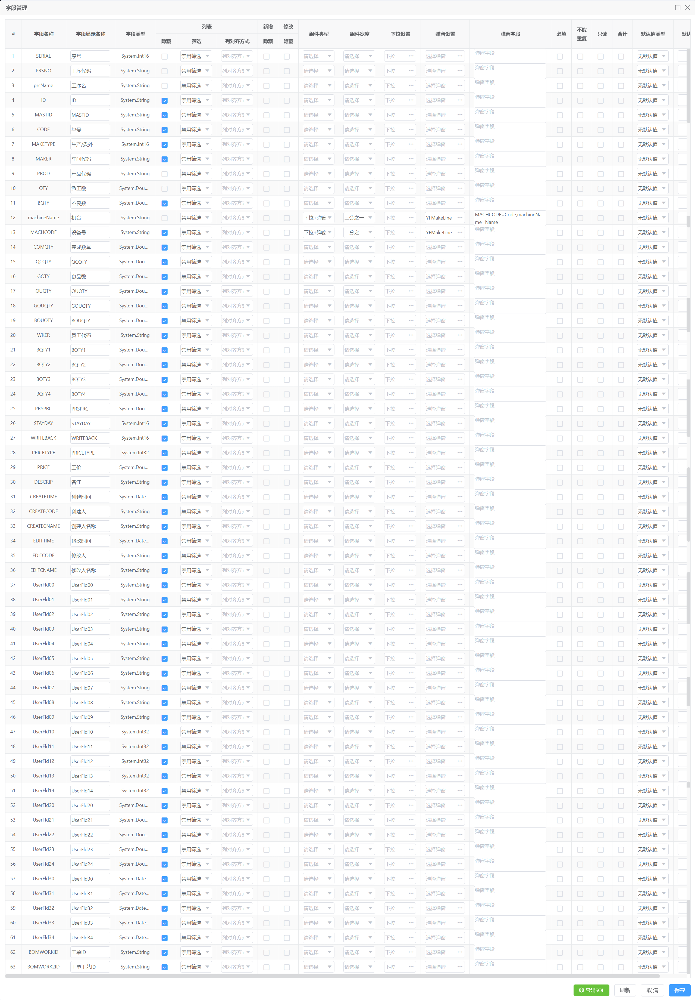

##### 2. 弹窗字段

1. machineName

    ```sql
    MACHCODE=Code,machineName=Name
    ```

    

## 3. 弹窗配置

### 1. YFWorkOrder

#### 1.图

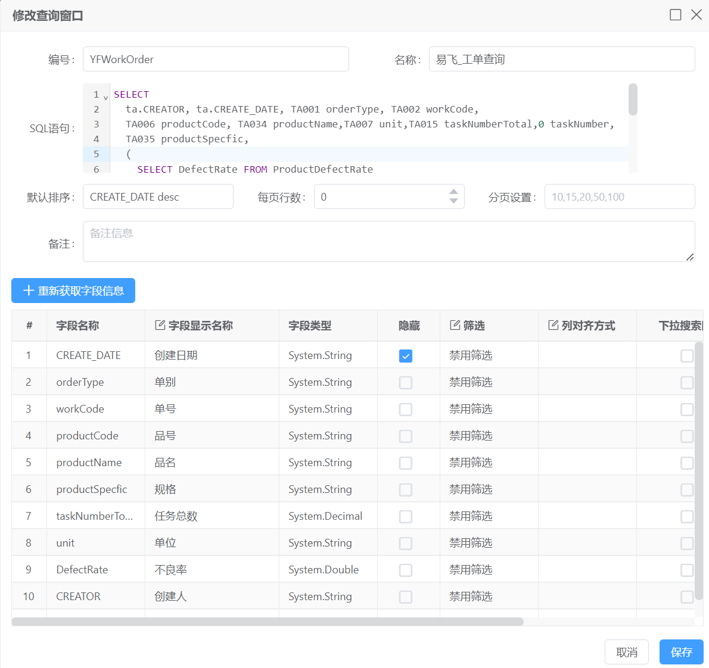

#### 2.sql

```sql
SELECT 
	ta.CREATOR, ta.CREATE_DATE, TA001 orderType, TA002 workCode, 
	TA006 productCode, TA034 productName,TA007 unit,TA015 taskNumberTotal,0 taskNumber,
  TA035 productSpecfic,
  (
    SELECT DefectRate FROM ProductDefectRate
    WHERE CardCode = (
      SELECT TOP 1 UDF01 FROM :ERPDB..INVMB WHERE MB001 = ta.TA006
    ) COLLATE Chinese_PRC_BIN
  ) DefectRate,
  ISNULL((
     SELECT SUM(QTY) qty FROM BOMWORKSUB1
      WHERE WORKCODE = ta.TA001 + '-' + ta.TA002 COLLATE Chinese_PRC_BIN
      GROUP BY WORKCODE
  ),0) taskedNumberTotal
FROM :ERPDB..MOCTA ta
```


### 2. YFBatchQuery

#### 1. 图

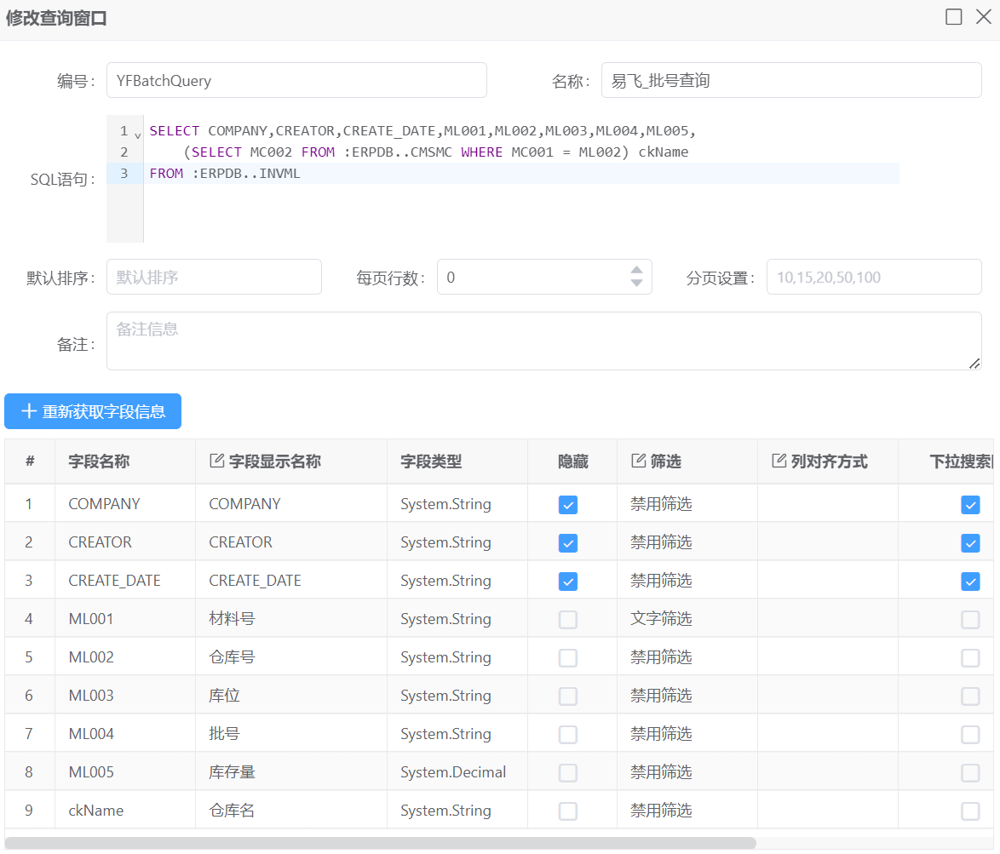

#### 2. sql

```sql
SELECT COMPANY,CREATOR,CREATE_DATE,ML001,ML002,ML003,ML004,ML005,
    (SELECT MC002 FROM :ERPDB..CMSMC WHERE MC001 = ML002) ckName
FROM :ERPDB..INVML
```


### 3. YF_PP_ProductQuery

#### 1. 图

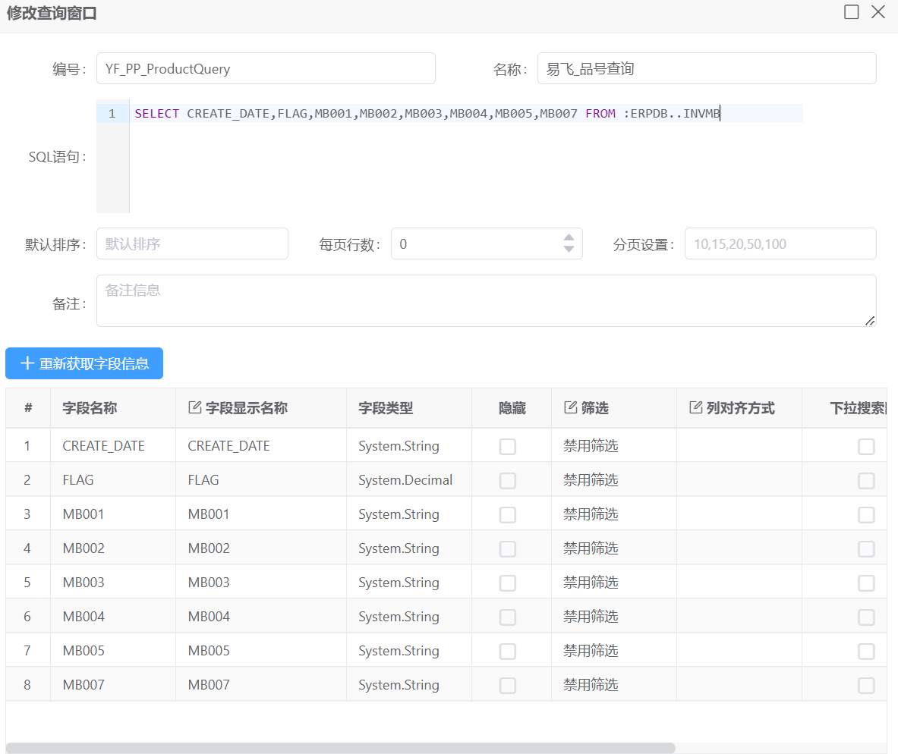

#### 2. sql

```sql
SELECT CREATE_DATE,FLAG,MB001,MB002,MB003,MB004,MB005,MB007 FROM :ERPDB..INVMB
```


### 4. YFMakeLine

#### 1. 图

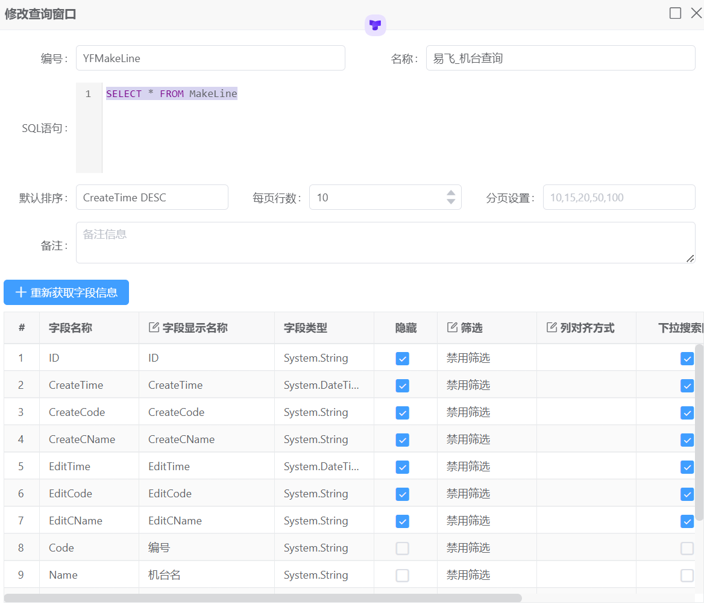

#### 2. sql

```sql
SELECT * FROM MakeLine
```


### 5. YF_PP_ckQuery

#### 1. 图

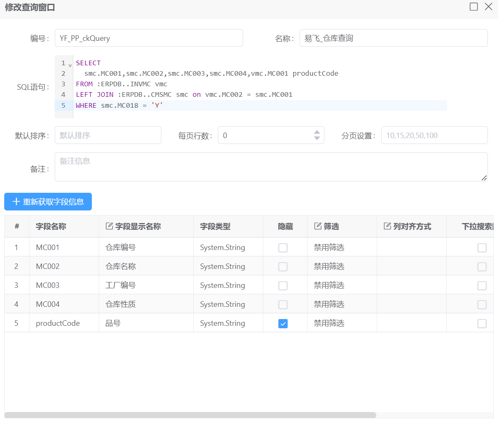

#### 2. sql

```sql
SELECT 
  smc.MC001,smc.MC002,smc.MC003,smc.MC004,vmc.MC001 productCode
FROM :ERPDB..INVMC vmc
LEFT JOIN :ERPDB..CMSMC smc on vmc.MC002 = smc.MC001
WHERE smc.MC018 = 'Y'
```

