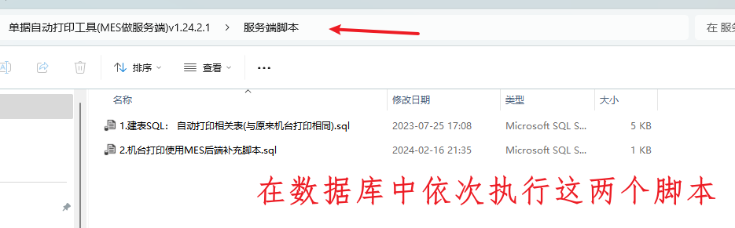
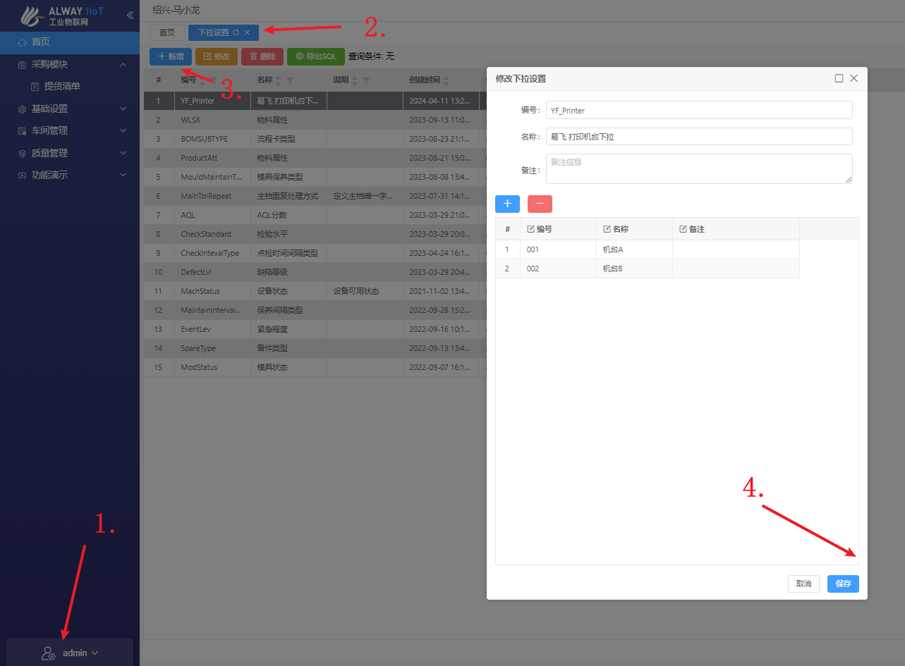
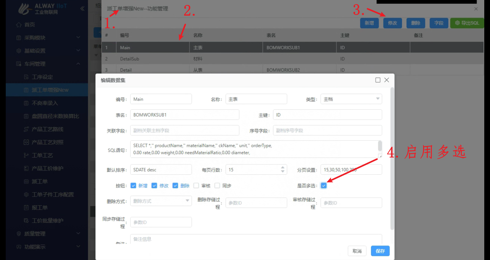
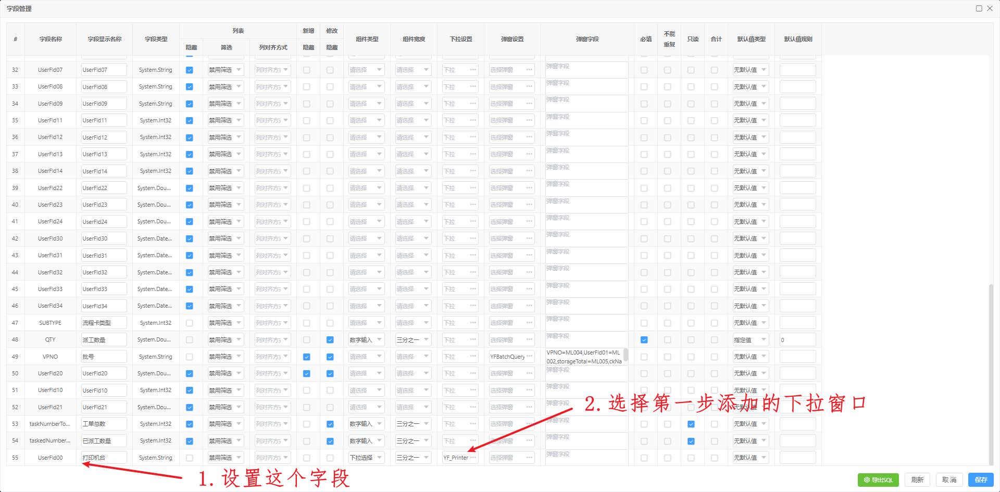

#### 1. 在MES数据库中执行以下脚本

> 此表用于记录MES派工单增强 新增-保存时 生成的材料信息记录

```sql
/****** Object:  Table [dbo].[BOMWORKSUB3]    Script Date: 2024-04-10 10:34:35 ******/
SET ANSI_NULLS ON
GO

SET QUOTED_IDENTIFIER ON
GO

CREATE TABLE [dbo].[BOMWORKSUB3](
	[ID] [varchar](26) NOT NULL,
	[MASTID] [varchar](26) NOT NULL,
	[PROD] [varchar](40) NOT NULL,
	[needRequireAmount] [float] NOT NULL,
	[advanceRequireAmount] [float] NOT NULL,
	[ckCode] [varchar](26) NULL,
	[batchCode] [varchar](26) NULL,
	[estimateLen] [float] NULL,
	[DESCRIP] [varchar](200) NULL,
	[CREATETIME] [datetime] NULL,
	[CREATECODE] [varchar](20) NULL,
	[CREATECNAME] [varchar](20) NULL,
	[EDITTIME] [datetime] NULL,
	[EDITCODE] [varchar](20) NULL,
	[EDITCNAME] [varchar](20) NULL,
	[UserFld00] [varchar](20) NULL,
	[UserFld01] [varchar](20) NULL,
	[UserFld02] [varchar](100) NULL,
	[UserFld03] [varchar](100) NULL,
	[UserFld04] [varchar](100) NULL,
	[UserFld05] [varchar](100) NULL,
	[UserFld06] [varchar](100) NULL,
	[UserFld07] [varchar](100) NULL,
	[UserFld08] [varchar](100) NULL,
	[UserFld09] [varchar](100) NULL,
	[UserFld10] [int] NULL,
	[UserFld11] [int] NULL,
	[UserFld12] [int] NULL,
	[UserFld13] [int] NULL,
	[UserFld14] [int] NULL,
	[UserFld15] [float] NULL,
	[UserFld16] [float] NULL,
	[UserFld17] [float] NULL,
	[UserFld18] [float] NULL,
	[UserFld19] [float] NULL
) ON [PRIMARY]
GO

```


#### 2. 执行单据自动打印工具(MES做服务端)中的脚本

**脚本1 在ERP数据库中执行**

**脚本2 在MES数据库中执行**



#### 3. 在MES前端中配置

##### 1. 配置打印机台下拉选项

> 左下角系统设置 -》 下拉设置 -》 新增



##### 2. 派工单增强 启用多选按钮

> 左下角系统设置-》菜单设置-》选中派工单增强New-》功能-》修改



##### 3. 派工单增强 设置字段

> 左下角系统设置-》菜单设置-》选中派工单增强New-》功能-》字段

