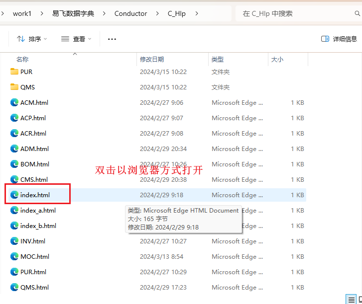

## 说明

这篇文档中记录了如何获取一份类似易助ERP的易飞ERP数据字典

##### 文件下载地址:

##### 如何使用：

###### 1.下载上述文件

###### 2.将上述文件解压存放在指定路径

###### 3.打开首页 并将这个页面添加到浏览器收藏夹中

## 起因

在对接易飞ERP的时候 苦于类似易助的数据字典，在实际开发过程中每次查询的时候步骤如下:

1. 远程登录服务器
2. 打开易飞ERP
3. 找到录入数据表功能 进行检索 然后在查看相应字段的注释

:cry: 太麻烦了

## 上才艺

…暂时没时间描述如何处理的(有空了再写)