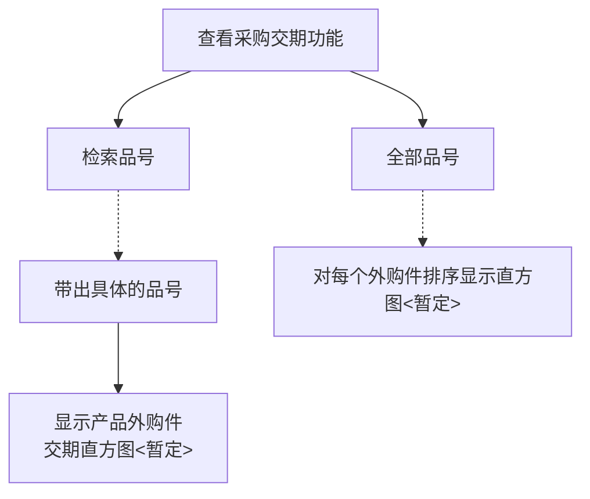

# 科恩-固美特ERP采购模块与MES对接方案

## 引言

### 编写目的

此可行性研究报告对科恩客户现有需求做了全面调查.明确所要开发的软件具有的功能，性能，限制，环境。

## 客户需求

此系统功能目前主要从两个维度来讨论

### 1.按照下单日期对数据进行展示

1. 按重要程度、型号、采购周期进行排序

    > 方便客户能够更直观的看到哪些外构件所需采购周期更长，以便进行针对性的优化

### 2.按照交货日期对数据进行展示

1. 按重要程度、品号、预计交期、实际交期进行排序

    > 方便客户能够更直观的看到外购件何时到达仓库 哪些外购件呆滞时间较长(方便对此进行优化)

2. 按颜色进行区分

    > 方便客户能够直观的看到该品号中哪些外购件存在交期问题进而影响生产

    1. 已到 : 绿色表示
    2. 距离交货日期(2-3天)还未到的：黄色警告
    3. 快到交货日期还未到的：红色警告
    4. 快到生产日期还未到的：深红色警告

### 3.过滤

1. 按重要程度过滤
2. 按品号过滤
3. 按颜色过滤

## 流程图

## 开发逻辑

本次开发内容主要涉及两块:

1. 后端读取数据表中的数据 并且以指定格式展示
2. 前端读取数据 进行图表展示以及交互操作

### 后端开发：

开发人员：马澳飞

#### 任务：

1. 读取原有ERP中的采购单据记录【展示品号的相关构建信息(品号、主件品号、品名、下单日期、要求交期、实际交期)】
    1. 按单个品号读取
    2. 按所有品号读取
    3. 要考虑排序 默认都是降序(耗时越长的在顶部)
        1. 按照下单日期
        2. 按照交货日期

### 前端开发：

开发人员：马小龙

#### 任务：

1. 读取后端数据 进行页面展示
    1. 以图表的形式进行展示
    2. 图表中支持交互操作
        1. 按照下单日期对数据进行展示(默认)
        2. 按照交货日期对数据进行展示
        3. 支持过滤操作
            1. 单个品号、全部品号
            2. 按照颜色类型过滤

## 初步排期

目前项目处于起步阶段,需要找客户要各种字段,并进行验证,考虑到同时负责其它项目的开发,第一期需求约为5-6天

#### 3.23-3.27 

主要进行数据对接(包括字段,以及需要维护到MES上的数据),环境运行,需求整理,开发方案细化,整理,可行性验证

#### 3.27- 3.30 

进行代码编写,功能测试,集成测试,数据同步与迁移

#### 3.30

进行第一期需求交付 (视情况可能提前或者推迟)
