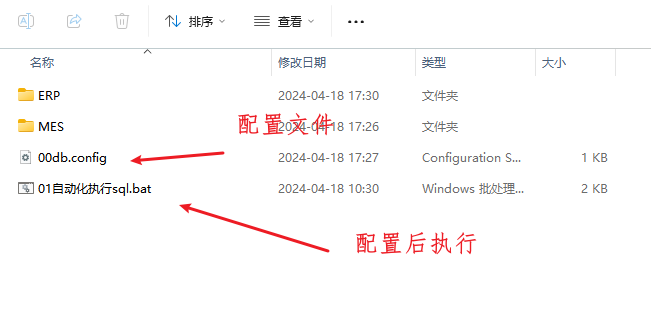
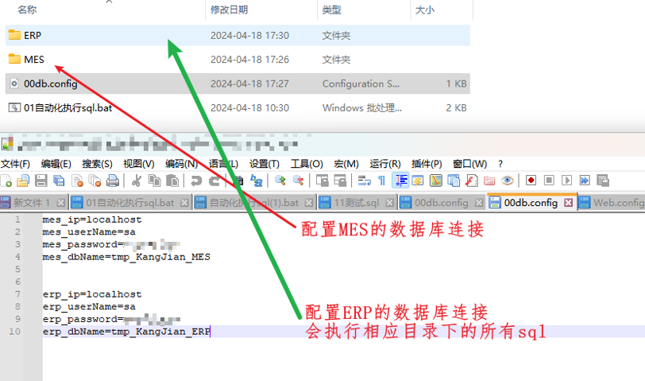
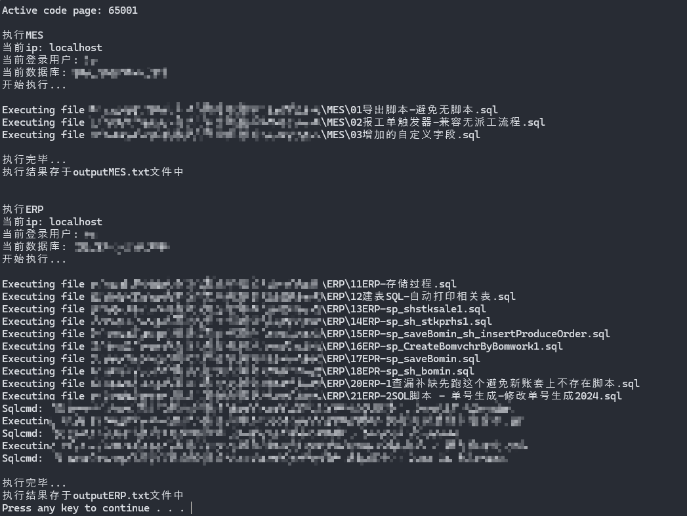

## 起因

批量执行脚本时  很繁琐  每个sql都需要去点击 然后运行

所以弄了个bat文件  批量执行

## 说明

`00db.config` 配置文件  脚本运行到哪个数据库中

`01自动化执行sql.bat` 配置好指定数据库后 双子执行

##### 配置好后执行效果如下:

相应的输出位于outputMES.txt outputERP.txt文件中

**注意:**

**脚本文件名 不要有空格和特殊字符  不然会报错的**

## 内容

