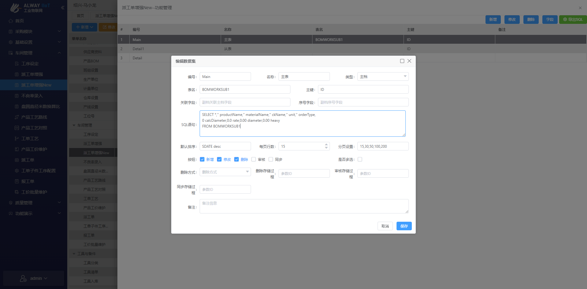
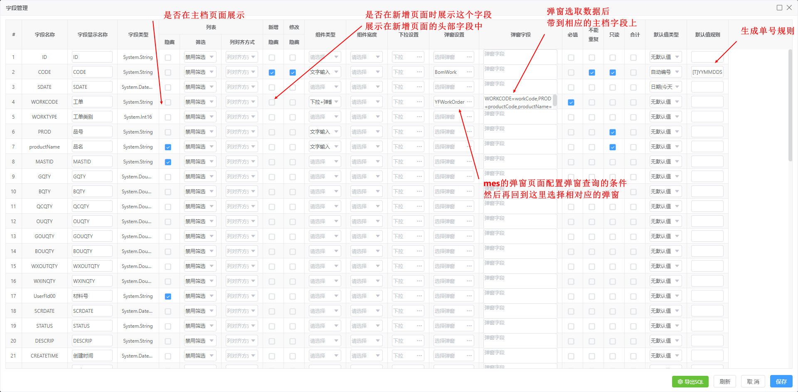
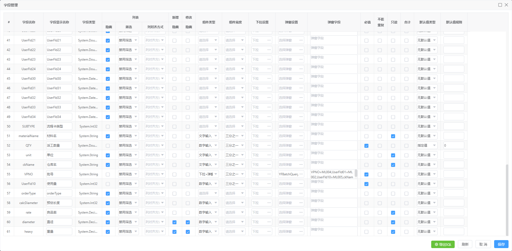
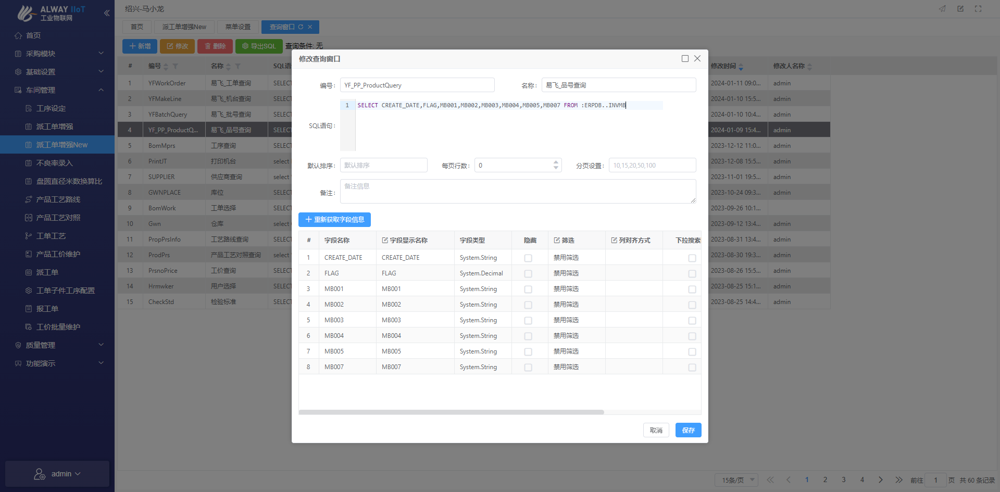
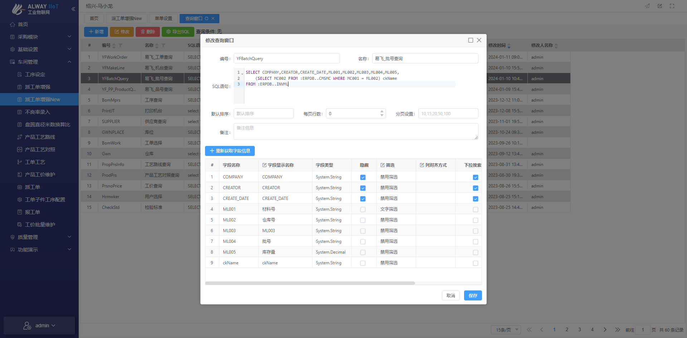
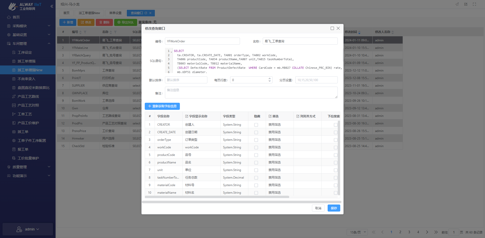
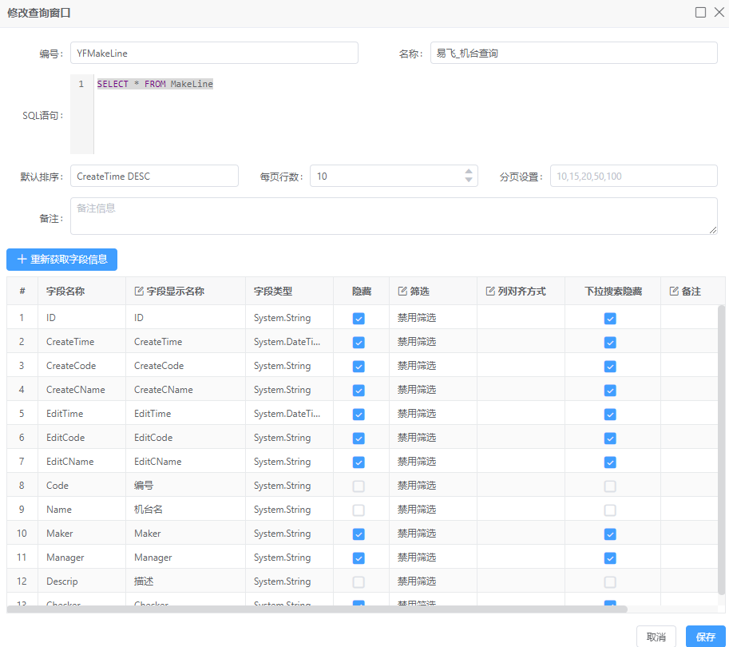

- [x] 派工单增强 mes 生成单号异常
- [ ] pda 检索异常


# 主档配置流程

## 派工单增强

### 1. 菜单设置

#### 主档-基本配置

```sql
SELECT *,'' productName,'' materialName,'' ckName,'' unit,'' orderType,
0 calcDiameter,0.0 rate,0.00 diameter,0.00 heavy
FROM BOMWORKSUB1
```



#### 主档-字段配置



*[YFWorkOrder配置](#YFWorkOrder)*

##### 弹窗字段

`WORKCODE`

```sql
WORKCODE=workCode,PROD=productCode,productName=productName,UserFld00=materialCode,materialName=materialName,unit=unit,QTY=taskNumberTotal,orderType=orderType,rate=rate,diameter=diameter,heavy=heavy
```

`VPNO`

```sql
VPNO=ML004,UserFld01=ML002,UserFld10=ML005,ckName=ckName
```



*[YFBatchQuery配置](#YFBatchQuery)*


# 查询窗口配置

### YF_PP_ProductQuery

###### 概况



###### sql

```sql
SELECT CREATE_DATE,FLAG,MB001,MB002,MB003,MB004,MB005,MB007 FROM :ERPDB..INVMB
```


### YFBatchQuery

###### 概况



###### sql

```sql
SELECT COMPANY,CREATOR,CREATE_DATE,ML001,ML002,ML003,ML004,ML005,
    (SELECT MC002 FROM :ERPDB..CMSMC WHERE MC001 = ML002) ckName
FROM :ERPDB..INVML
```


### YFWorkOrder

###### 概况



###### sql

```sql
SELECT 
	ta.CREATOR, ta.CREATE_DATE, TA001 orderType, TA002 workCode, 
	TA006 productCode, TA034 productName,TA007 unit,TA015 taskNumberTotal,
	TB003 materialCode, TB012 materialName,
  mb1.UDF51 materialLen,
  (SELECT DefectRate FROM ProductDefectRate WHERE CardCode = mb2.MB027 COLLATE Chinese_PRC_BIN) rate,
	(SELECT Weight FROM ProductConversionRatio WHERE Diameter = mb1.UDF51) weight,
  ISNULL((tb.TB004/NULLIF(ta.TA015,0)),0) needMaterialRatio
FROM :ERPDB..MOCTA ta
LEFT JOIN :ERPDB..MOCTB tb ON ta.TA001 = tb.TB001 AND ta.TA002 = tb.TB002
LEFT JOIN :ERPDB..INVMB mb1 ON tb.TB003 = mb1.MB001
LEFT JOIN :ERPDB..INVMB mb2 ON tb.TB014 = mb2.MB001
```

### YFMakeLine

###### 概况



###### sql

```sql
SELECT * FROM MakeLine
```

