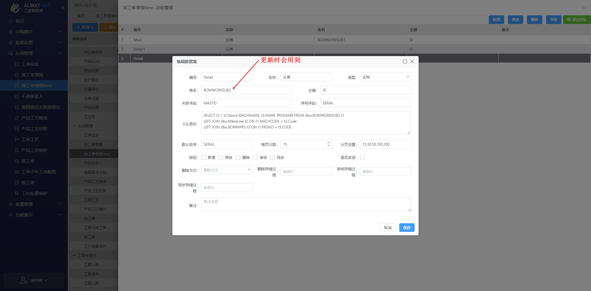
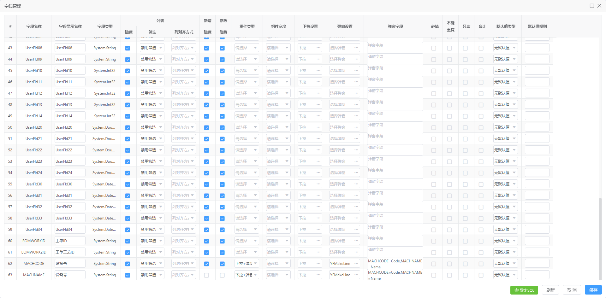
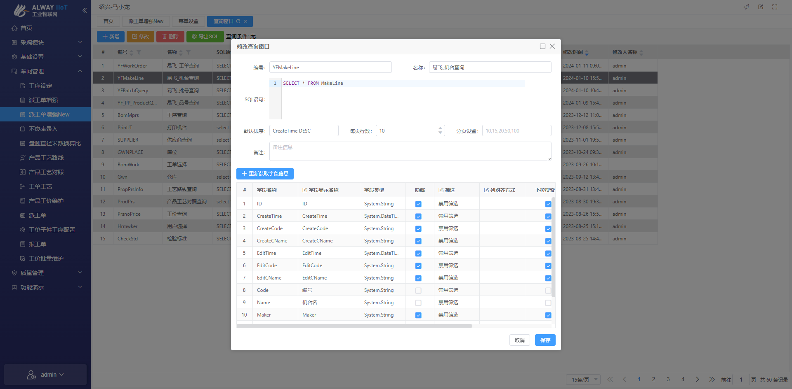

# 派工单增强

## 副档配置流程

### 1. 菜单设置

###### 概况



###### sql

```sql
SELECT t1.*, t2.Name MACHNAME, t3.NAME PRSNAME FROM dbo.BOMWORKSUB2 t1
LEFT JOIN dbo.MakeLine t2 ON t1.MACHCODE = t2.Code
LEFT JOIN dbo.BOMMPRS t3 ON t1.PRSNO = t3.CODE
```


### 2.字段设置

[YFMakeLine配置](#YFMakeLine)

###### 概况



###### sql

`YFMakeLine`

```sql
MACHCODE=Code,MACHNAME=Name
```

### 3. 查询窗口配置

#### YF

###### 概况



###### sql

```sql
SELECT * FROM MakeLine
```

