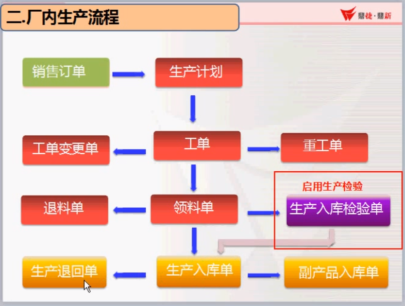

##### 生产操作逻辑:

1. 产生工单
2. 工单拆分为派工单
3. 派工单领料
4. 工单报工
5. 报工审核
6. 生产入库  *可能有质检*



审核后加管控

- [x] 批号: 如果启用 使用当前日期 没有就默认星号

- [x] 一行记录一条入库单


- [x] 报工单号放入自定义字段: 表:`SGMRCB`字段:`RCB960`
- [x] 使用配置文件控制客户的报废仓库代码
- [x] 废品耗用大于0 小于0.01时 统一按照0.01计算
- [x] 取消良品入库


批号: 如果启用 使用当前日期 没有就默认星号


```sql
declare @isUseVPNO varchar(1) set @isUseVPNO = (select DEA055 from TPADEA WHERE DEA001 = @mprod)
declare @VPNO varchar(20) set @VPNO = '********************'
IF @isUseVPNO = 'T'
BEGIN
	set @VPNO = CONVERT(varchar(100), GETDATE(), 112)
END
```

一行记录一条入库单

报工单号放入自定义字段: 表:`SGMRCB`字段:`RCB960`


```sql
--  @workcode 工单号   @staff 制单，@qty入库数量，@vpno批号， @sh 是否要审核入库单 0不审核，1审核(默认值) , @issub1code是否批次卡入库，0否(默认值)，1是
--  @wker 员工  @jitai机台, @MPROD 品名 用于查询是否启用批次号,
ALTER PROCEDURE [dbo].[sp_saveBomin_sh_insertProduceOrder] 
  @code varchar(20), @staff varchar(8), --@vpno varchar(20), 
  @qty varchar(20), @bqty varchar(20), 
  @ingwn varchar(6),@sh int,@issub1code int,
  @MESID varchar(20),@daokou int = 0,
  @wker  varchar(10),@jitai varchar(20),
	@SUBCODE varchar(20),
	@reportWorkOrder varchar(20)
AS      

if isnull(@code, '') = ''   
begin
  select 3,'','传入的单号为空' 
  return
end

declare @workcode varchar(20), @sub1code varchar(20)  
if @issub1code = 1  --批次卡入库  
begin
  set @sub1code = @code
  set @workcode = (select WORKCODE FROM BOMWORKSUB1 WHERE CODE = @sub1code)
end
else begin
  set @sub1code = ''
  set @workcode = @code
end

if isnull(@workcode, '') = ''   
begin
  select 4,'','找不到对应的工单' 
  return
end

if isnull(@reportWorkOrder, '') = ''   
begin
  select 3,'','传入的报工单为空' 
  return
end
 
declare @mprod varchar(30)   set @mprod   = (SELECT RAA015 FROM SGMRAA WHERE RAA001=@workcode)  
declare @unit varchar(4) set @unit =(select top 1 DEA003 from  TPADEA WHERE DEA001=@mprod) 
declare @sdate datetime   set @sdate   = GETDATE() 
declare @date8bit varchar(8) set @date8bit = CONVERT(varchar(100), @sdate, 112)  
declare @depart varchar(6) set @depart = (select top 1 DBA005 from TPADBA where DBA001=@staff)  
--部门默认的现场仓
declare @vchrGWN varchar(6) set @vchrGWN = (select DAA960 from TPADAA, SGMRAA where DAA001=RAA005 and RAA001= @workcode)
declare @fromtype varchar(2) set @fromtype = '81'      
declare @vchrtype varchar(2) set @vchrtype = '84'   -- 84:入库  85：还回
declare @EmptyVpno varchar(20) set @EmptyVpno = '********************'     

--if isnull(@vpno,'') = '' set @vpno = @EmptyVpno 
declare @isUseVPNO varchar(1) set @isUseVPNO = (select DEA055 from TPADEA WHERE DEA001 = @mprod)
declare @VPNO varchar(20) set @VPNO = '********************'
IF @isUseVPNO = 'T'
BEGIN
	set @VPNO = CONVERT(varchar(100), GETDATE(), 112)
END
 
declare @incode varchar(14) set @incode=''  -- 入库单号
declare @qtynum int set @qtynum =(select CAA010 from TPACAA)   -- 数量小数位
 

if @mprod IS NULL 
begin
  select 5,'','工单号不存在' 
  return
end 
if isnull(@ingwn, '') = ''   
begin
  select 6,'','仓库为空' 
  return
end
if  (isnull(@staff, '') = '') 
begin
  select 7,'','制单人为空' 
  return
end 

declare @bomvchrcode varchar(20) set @bomvchrcode =''
if @daokou > 0   --倒扣料
begin
     if Object_Id('tempdb..#CreateBomvchr') <> 0
        drop table #CreateBomvchr  
     create table #CreateBomvchr(ID varchar(3),DATA varchar(255), MSG varchar(255))  
     insert into #CreateBomvchr(ID, DATA, MSG) exec dbo.sp_CreateBomvchrByBomwork1 @workcode,@bqty,@staff, 1		-- 注意这里 传入的是bqty 因为当前存储过程只用于废品入库
     if (select top 1 ID from #CreateBomvchr) <> '0'
     begin
       select top 1 ID,DATA,'创建倒扣料失败，'+isnull(MSG,'') from #CreateBomvchr
       return
     end 
	 set @bomvchrcode = isnull((select top 1 [DATA] from #CreateBomvchr),'')
     if Object_Id('tempdb..#CreateBomvchr') <> 0
        drop table #CreateBomvchr  
end

  --入库单头
  set @incode = (select dbo.GenCode_BomIn(@sdate)) 
  INSERT INTO SGMRCA ( 
    RCA001   --单据类型 84:生产入库85.生产退回
    ,RCA002   --单据号码
    ,RCA004   --单据日期
    ,RCA005   --经办人
    ,RCA006   --部门
		,RCA013 	--备注(派工单)
    ,RCA016   --审核码 F:未审核T:已审核
    ,RCA019   --是否检验F:否 T:是
    ,RCA026   --凭证抛转否T 已抛转F 未抛转N 永不抛转
    ,RCA030   --来源 01工艺入库
    ,RCA031   --批号
    ,RCA901   --录入者编号
    ,RCA902   --录入时间
    ,RCA903   --更改者编号 
	,RCA905    --更新标记
    ,RCA960    --MES中的入库回报记录ID
	,RCA961
	,RCA962
	,RCA964
  ) 
  VALUES ( '84'  ,@incode ,@date8bit
    ,@staff  ,@depart, @SUBCODE 
    ,'F' ,'F' ,'F' ,'01'
    ,@VPNO
   ,@staff ,convert(varchar,getdate(),121) ,@staff ,1, isnull(@MESID,''), ISNULL(@wker,''), ISNULL(@jitai,''),@SUBCODE) 
 
   --入库单  - 工单信息档
  INSERT INTO SGMRCC (
     RCC001    --类型： 84:生产入库85.生产退回
     ,RCC002    --单号
	 ,RCC003    --来源
	 ,RCC004    --来源单号
	 ,RCC011    --来源序号
	 ,RCC022    --序号
	 ,RCC005    --入库仓库
	 ,RCC006    --入库数量
	 ,RCC007    --报废数量
	 ,RCC008    --批号
	 ,RCC010    --主件品号
	 ,RCC012    --工单类别
	 ,RCC013    --工单单号
	 ,RCC901    --录入者编号
	 ,RCC902    --录入时间
	 ,RCC903    --更改者编号
	 ,RCC905    --更新标记,
	 ,RCC960
	 ) 
	 VALUES ('84',@incode,@fromtype
	 ,@workcode   --来源单号
	 ,'000'    --来源序号
	 ,'001'    --序号
	 ,@ingwn   --入库仓库
	 ,@qty,@bqty --入库数量
	 ,@VPNO  --批号
	 ,@mprod --主件品号
	 ,@fromtype,@workcode   --工单单号
	 ,@staff,convert(varchar,getdate(),121),@staff,1,@SUBCODE)
 
   --入库单  单身
  declare @needqty numeric(12,4),@needBqty numeric(12,4), @serial varchar(3) 
  
 -----处理含耗料： 允许领料时多个批号， 按实际领料 * 入库数/工单数 进行扣料，如果未领完料就入库的，手工去易助处理
  if Object_Id('tempdb..#sp_bomin1') <> 0
     drop table #sp_bomin1  
 create table #sp_bomin1(
			ID INT Identity(1,1), 
			CODE VARCHAR(20) COLLATE database_default,	-- 工单单号
			SERIAL VARCHAR(3) COLLATE database_default,  -- 序号
			SUBPROD varchar(40) COLLATE database_default,  -- 子件品号
			GWN VARCHAR(6) COLLATE database_default, -- 转入仓库
			VPNO VARCHAR(20) COLLATE database_default, -- 批号
			CQTY NUMERIC(12,4), -- 
			ORDERBYQTY INT, 
			VCHRQTY NUMERIC(12,4), 
			VCHRBQTY NUMERIC(12,4))      
  
  --获取所有已送料的记录：   每个子件的单号、序号、现场仓、批号、送货总数量 - 耗用总数量                            
  INSERT INTO #sp_bomin1(CODE,SERIAL,SUBPROD,GWN,VPNO,CQTY,ORDERBYQTY,VCHRQTY,VCHRBQTY) 
    SELECT X.CODE,X.SERIAL,X.SUBPROD,X.GWN,X.VPNO,INQTY-ISNULL(OUTQTY,0) CQTY,case when INQTY-OUTQTY > 0.0000001 then 0 when INQTY-OUTQTY < -0.0000001 then 2 else 1 end ORDERBYQTY,0,0  FROM
    (
				-- 根据工单号 获取工单中所有子件的【已领料】记录
        SELECT RAB001 CODE,RAB002 SERIAL,RAB003 SUBPROD,isnull(RBB021,'********************') VPNO,
          isnull((CASE WHEN RBB001 IN ('82','8C') THEN RBB008 ELSE RBB007 END),@vchrGWN) GWN,
          SUM((CASE WHEN RBB001 IN ('82','8C') THEN 1 ELSE -1 END)*RBB009) INQTY             
        FROM SGMRAB   
          LEFT JOIN SGMRBB ON RAB001=RBB010 AND RAB002=RBB011 AND RBB013='T'  
          WHERE RAB001=@workcode 
        GROUP BY RAB001,RAB002,RAB003,RBB021,(CASE WHEN RBB001 IN ('82','8C') THEN RBB008 ELSE RBB007 END) 
    )X
    LEFT JOIN (SELECT RCB022 CODE, RCB027 SERIAL,RCB007 GWN,RCB019 VPNO,
           SUM((CASE WHEN RCB001='84' THEN 1 ELSE -1 END)*RCB008) OUTQTY
         FROM SGMRCB WHERE RCB021 = '81' AND RCB022=@workcode --AND RCB010='T'
         GROUP BY RCB022, RCB027,RCB007,RCB019
       ) Y ON X.CODE=Y.CODE AND X.SERIAL=Y.SERIAL AND X.GWN=Y.GWN AND X.VPNO=Y.VPNO  
   ORDER BY X.CODE,X.SERIAL,X.SUBPROD,case when INQTY-OUTQTY > 0.0000001 then 0 when INQTY-OUTQTY < -0.0000001 then 2 else 1 end,X.VPNO

    DECLARE @ID INT,@CQTY NUMERIC(12,4), @UpdateQty NUMERIC(12,4)
    declare @USEBOMQTY bit = 0  -- 1根据bom标准用料按比例耗用； 0 根据已领料数，按比例耗用
    if @USEBOMQTY = 1   -- 1根据bom标准用料按比例耗用
      declare bomlist cursor local READ_ONLY FAST_FORWARD for
       select REB002 SERIAL,ROUND(@qty*REB007/REA018,@qtynum) VCHRQTY, ROUND(@bqty*REB007/REA018,@qtynum) VCHRBQTY FROM SGMREB  
          LEFT JOIN SGMREA ON REA001=REB001    
          left join TPADEA on REB003=DEA001 
        WHERE REB001= @workcode 
        ORDER BY REB002 
    else   --0 根据已领料数，按比例耗用
      declare bomlist cursor local READ_ONLY FAST_FORWARD for
       select RAB002 SERIAL,
			 ROUND(@qty*RAB008/RAA018,@qtynum) VCHRQTY, -- 良品数量 * 已领料量 / 生产数量   计算单个良品的平均耗用量
			 ROUND(@bqty*RAB008/RAA018,@qtynum) VCHRBQTY -- 不良品数量 * 已领料量 / 生产数量  计算单个不良品的平均耗用量
			 FROM SGMRAB  
          LEFT JOIN SGMRAA ON RAA001=RAB001    
          left join TPADEA on RAB003=DEA001 
        WHERE RAB001= @workcode 
        ORDER BY RAB002 
	open bomlist
	fetch next from bomlist into @serial,@needqty ,@needBqty
	while @@fetch_status = 0
	begin
	  declare subprodlist cursor  for select ID,CQTY from #sp_bomin1 where SERIAL=@serial 
	  open subprodlist
	  fetch next from subprodlist into @ID,@CQTY   
	  while @@fetch_status = 0
	  begin
		if (@CQTY < 0.00000001)  --如果此条库存没有，直接扣减在此条上，再往后都是没有库存的，往后比较没意义.只能放在第一句
		begin
		  update #sp_bomin1 set VCHRQTY=@needqty, VCHRBQTY=@needBqty where ID=@ID 
		  break;
		end
		if (@needqty + @needBqty > 0) and (@CQTY - @needqty - @needBqty > -0.00000001) --库存足够，一次扣完
		begin
		  update #sp_bomin1 set VCHRQTY=@needqty, VCHRBQTY=@needBqty where ID=@ID 
		  break;
		end
		
		if (@CQTY > 0) and (@needBqty  > 0.00000001) -- 处理良品扣料数（送料的库存占用）
		begin
		  set @UpdateQty =(case when @CQTY-@needqty>-0.0000001 then @needqty else @CQTY end)
		  update #sp_bomin1 set VCHRQTY= @UpdateQty where ID=@ID
		  set @CQTY = @CQTY - @UpdateQty
		  set @needqty = @needqty - @UpdateQty
		end
		if (@CQTY > 0.000000001) and (@needBqty  > 0.00000001) -- 处理不良品扣料数（送料的库存占用）
		begin
		  set @UpdateQty =(case when @CQTY-@needBqty>-0.0000001 then @needBqty else @CQTY end)
		  update #sp_bomin1 set VCHRQTY= @UpdateQty where ID=@ID
		  set @CQTY = @CQTY - @UpdateQty
		  set @needBqty = @needBqty - @UpdateQty
		end 
		 
		if @needqty + @needBqty < 0.0000001   -- 本子件扣料完成， 进行下一子件扣料的循环
		  break;
		 
		fetch next from subprodlist into @ID,@CQTY  
	  END
	  close subprodlist
	  deallocate subprodlist
	  fetch next from bomlist into @serial,@needqty ,@needBqty
	end   
	close bomlist
	deallocate bomlist

	delete #sp_bomin1 where VCHRQTY + VCHRBQTY < 0.00000001   --不需要扣的， 删除， 将需要扣的生成委外收货单耗用档

   --入库单  单身
   INSERT INTO SGMRCB ( 
           RCB003 -- 序号1
          ,RCB001 -- 类型： 84:生产入库85.生产退回2
          ,RCB002 -- 单号3
          ,RCB004 -- 子件品号4
          ,RCB005 -- 品名(预留)5
          ,RCB006 -- 单位6
          ,RCB007 -- 耗用仓库7
          ,RCB008 -- 耗用量8
          ,RCB018 -- 报废耗用量9
          ,RCB010 -- 审核码 F:未审核T:已审核10
          ,RCB019 -- 子件批号11
          ,RCB020 -- 规格12
          ,RCB021 -- 来13
          ,RCB022 -- 来源单号14
          ,RCB023 -- 来源序号15
          ,RCB024 -- 主件品号16
          ,RCB025 -- 工单类别7
          ,RCB026 -- 工单单号8
          ,RCB027 -- 工单序号9
          ,RCB028 -- 主档的成品批号0
          ,RCB029 -- 单身序号1
          ,RCB901 -- 录入者编号2
          ,RCB902 -- 录入时间3
          ,RCB903 -- 更改者编号4
          ,RCB905 -- 更新标记5
					,RCB960 -- 报工单6
          ) 
     SELECT RIGHT('000' + CAST(ROW_NUMBER() OVER (ORDER BY Z.RAB002 ASC) AS VARCHAR),3) SERIAL,Z.*  --序号1
     FROM (
        SELECT DISTINCT 
           @vchrtype ATYPE --类型 2
          ,@incode CODE  --单号 3
          ,RAB003 PROD  --根据工单号从工单单头当取出子件品号RAB003           4
          ,DEA002 CNAME -- 品名                   5
          ,DEA003 AUNIT -- 单位    6
          ,B.GWN  ----耗用仓库，原来用的RAB006 GWN，空的7
          ,B.VCHRQTY, B.VCHRBQTY -- 耗用量,报废耗用量89
          ,'F' SH --审核码10
          ,case when DEA055='T' then B.VPNO else @EmptyVpno end VPNO1  --批号    1             
          ,DEA057 -- 规格2
          ,@fromtype FROMTYPE1 --来源 工单81 3
          ,RAB001 WORKCODE1  --来源单号4
          ,'000' SERIAL1 --来源序号5
          ,RAA015  --主件品号6
          ,@fromtype FROMTYPE2 --工单类别7
          ,RAB001 WORKCODE2 --工单单号8
          ,RAB002  --工单序号9
          ,@VPNO VPNO2 --单身批号10
          ,'001' SERIAL2 --单身序号1
          ,@staff STAFF,convert(varchar,getdate(),121) D,@staff DS,1 AS U  --2345
					,@reportWorkOrder ord --6
        FROM SGMRAB
          left join #sp_bomin1 B on RAB002=B.SERIAL  COLLATE database_default
          LEFT JOIN SGMRAA ON RAA001=RAB001    
          left join TPADEA on RAB003=DEA001 
        WHERE RAB001= @workcode and isnull(B.SERIAL,'') <> ''  
       )  Z
     ORDER BY RAB002 
 -------- 耗料结束
 
 
      
 
   --1.2 审核入库单
   IF @sh = 1 
   BEGIN
     if Object_Id('tempdb..#incode_sh') <> 0
        drop table #incode_sh  
     create table #incode_sh(ID varchar(3), DATA varchar(255), MSG varchar(255))  
     insert into #incode_sh(ID, DATA, MSG) exec dbo.sp_sh_bomin @incode,@staff 
     if (select top 1 ID from #incode_sh) <> '0'
     begin
       select top 1 ID,DATA,'审核入库单失败，'+isnull(MSG,'') from #incode_sh
       return
     end   
     if Object_Id('tempdb..#incode_sh') <> 0
        drop table #incode_sh  
   END
 
   select 0, @incode,''
```
